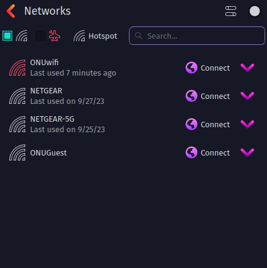
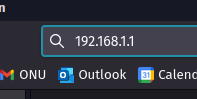
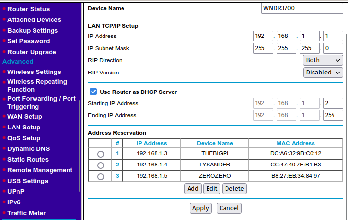
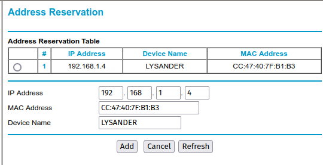
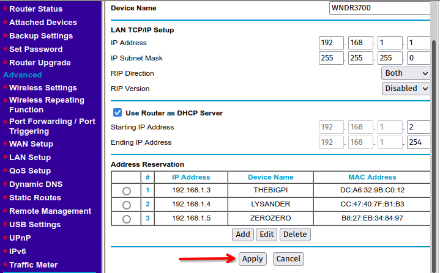
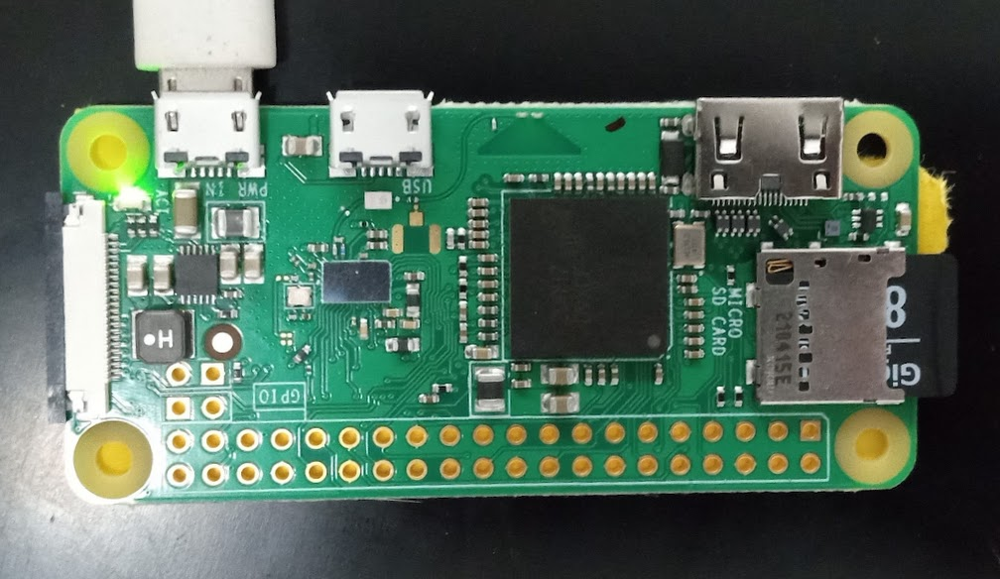
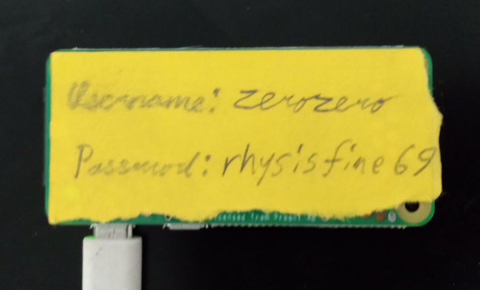
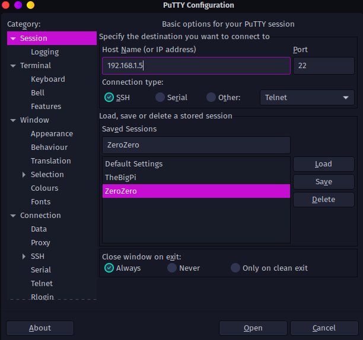
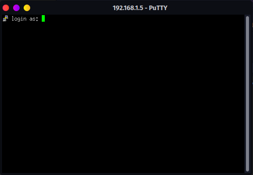
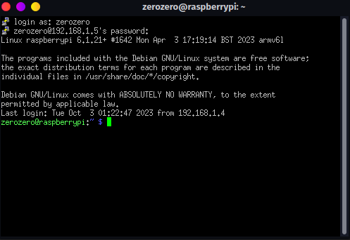

# Intro

This guide goes over the basics of how to get the data acquisition program up and running a Raspberry Pi. It includes:
- Router Setup / Address Reservation
- SSHing into Raspberry Pi
- Running the program and outputting your data

# Router Setup
To begin using the data acquisition program, we need to setup our NETGEAR router in order to SSH into the Raspberry Pi.

1. Make sure the NETGEAR router is plugged in and the "2.4GHz" light is on. Using a laptop, connect to the NETGEAR router using WiFi:
	
	*(Example of WiFi list on Garuda Linux, this may differ with your system)*

2. Using a web browser, type "192.168.1.1" into your URL bar:

	
	
3. If prompted for username and password, enter the following:
```
Username: admin
Password: password
```

4. Click "LAN Setup" on the left and you will find yourself here:
	
	
5. Under address reservation, click "Add". You will find a list of the currently connected devices to the router. Find your device from the list and copy the corresponding information:

	
	
6. Return to the "LAN Setup" menu and click "Apply". 
	
	
7. We have now successfully reserved the IP address for your computer, and it will always maintain the same local IPv4 address, making it much easier to connect with. Repeat this process if the Raspberry Pi you want to connect to is not listed under "Address Reservation."
# Raspberry Pi SSH
In order to run our data acquisition program, we will use a handy Pi Zero as it is tiny and can fit into the robot while it is driving, and a laptop does not have this "being small" functionality.

1. Plug in the Raspberry Pi Zero and ensure the green light is on. At the time of writing, the only Pi Zero available is 'zerozero'. This may differ in the future, there should be a label on your Pi telling you the name of it. It will follow the naming scheme of 'zerozero', 'zeroone', 'zerotwo', etc. 
	
  
	
1. Download and install PuTTy, a common SSH client: https://putty.org/

2. Open PuTTy. Refer to the "Address Reservation" list from Router Setup for the IP address of the Pi you want to connect to, and enter it into the "Host Name (or IP Address)" box. If Port is not set, default to 22.

	
	*Pro Tip: you can save IP addresses and load them so you don't have to refer to the Address Reservation later!*

3. Click "Open". You will be sent to this screen: 
4. Enter the username after "login as: ". The username is the same name as the label and the one listed in Address Reservation. In our case, it will be 'zerozero'. 
5. When prompted for the password, it should be on the back of your Pi. In our case, it will be 'rhysisfine69'. You will then be sent to the Linux terminal for the Pi Zero!
	 
# Serial Monitor Program
Now we are going to RUN THE PROGRAM!!!!

1. On GitHub, you will find a repository titled PR-Data-Aq. Under this repository you want to download the latest release of `SerialMonitor.py`.

2.  Using FileZilla or any other file transfer means, copy `SerialMonitor.py` from your computer into the Pi's home directory:


	
3. Run the program using the following command:
```bash
python ./SerialMonitor.py
```

4. The program will begin running and will ask you for the name of the file you want to output to (do not include an extension, .csv will be added for you):


5. The data acquisition will commence. Once you are finished with your tests, hit ENTER on your keyboard to immediately terminate the program:


6. The `.csv` file containing your data  will be outputted into your home directory:

7. You can download this `.csv` to your computer using FileZilla.