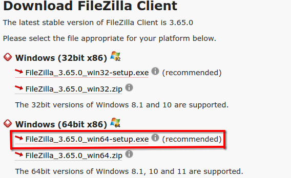

# Installing FileZilla

This guide goes over how to use FileZilla to transfer files between a Raspberry Pi and your computer. This guide may also apply to other computers as well.

## Windows

Click [here](https://filezilla-project.org/download.php?show_all=1) to go to FileZilla's download page. Download the setup.exe for 64bit x86: 

Run the installer and you're good to go.

## MacOS

No idea. Feel free to figure it out and update this doc!

## Linux
Enter the following commands into your terminal by your distro:

Debian/Ubuntu:
`sudo apt install filezilla`

Arch:
`sudo pacman -S filezilla`

Misc: Refer to your distro's guide on building packages.

# IP Configuration

1. Open FileZilla. You will find the following boxes at the top of your screen:

2. You want to use the same information that you used in `Raspberry-Pi-SSH.md`. It should look something like this:

3. When you press `Quickconnect` it will automatically connect to the Raspberry Pi/other device and show it's directory. This will allow you to download the testing .csv files from the Pi.
