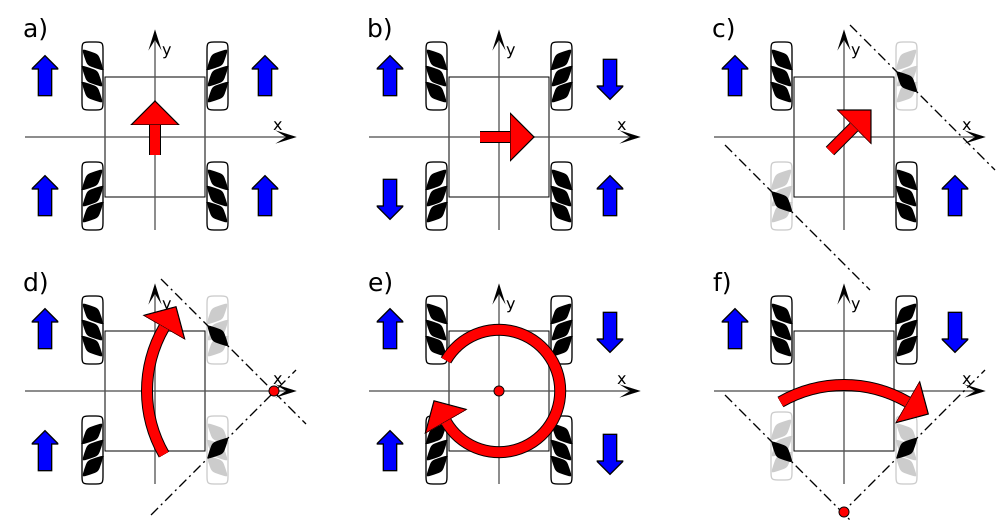

# `DriveMecanum.cpp`
## Description
- This file, which contains the functions of the DriveMecanum class, controls several parameters related to the driving of the robots with Mecanum wheels. The purpose of this code is to ensure that the robots respond appropriately to controller input. Based on stick inputs from a controller, this code will alter the speed of a robot's motors. The code also incorporates ramping to ensure that the robots don't lose control due to the motors starting up too quickly.
- This code is intended to be used with robots featuring the Mecanum wheel configuration, with each of the four wheels connected to its own motor. Further information on the mechanics of Mecanum driving can be found [here](https://gm0.org/en/latest/docs/software/tutorials/mecanum-drive.html) or seen in the diagram below.
{w=500px align=center}
## Functions
| Name | Description
|------|-------------
| `DriveMecanum` | This function acts as a constructor, calling the base Drive class constructor while also initializing an array for the power of each of the four motors.
| `setupMotors` | This function helps to establish the pins being used by the motors, therefore establishing the routes that will be used by the ESP32 to communicate with the motors.
| `setStickPwr` | This function helps to set the power of the motors by normalizing the input values coming from the stick. After normalization, the function also checks to see if the stick is within the deadzone and adjusts the values accordingly.
| `generateMotorValuesOld` | This function is an old version of `generateMotorValues`, which can be seen below.
| `generateMotorValues` | This function changes the power of the motors based on the forward power, strafing power, and turning power values as indicated by the control stick. This serves as a key component in making the robots responsive to control.
| `emergencyStop` | This function writes all motor values to zero, stopping any movement the robot might be making.
| `update` | This function writes values to the motor based on the values generated by `generateMotorValues`, changing their speed and completing the process of making the robots controllable.
| `printDebugInfo` | This function displays the stick strafe power, stick forward power, stick turn power, and the power levels of each motor. This information is displayed in the terminal.
## Included Headers
- `Arduino.h`
- `Drive/Drive.h`
- `DriveMecanum.h`