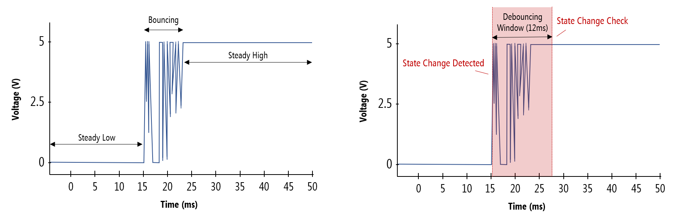

# `Debouncer.h`
## Description
- The `Debouncer` class is used to perform debouncing for the electrical signals resulting from any mechanical buttons, usually on the PS5 controller.

- Generally, inside a loop, wrap your call to check the input needing debouncing with one of the available functions.
- The class is also designed to work with either active high or active low circuits.
  - Internally, this is stored in the `BASE_STATE` and `ACTIVE_STATE` private fields, assigned appropriately based on if `activeLow` is `true` or `false` (default `false`) in the constructor.
    - This corresponds to the `enum DebouncerState` with values `base`, `active`

## Included Headers
- [`PolarRobotics.h`](../polar-robotics-h.md)