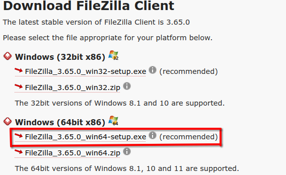
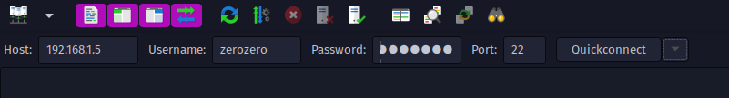

# Installing FileZilla
## Overview
- This guide goes over how to use FileZilla to transfer files between a Raspberry Pi and your computer. 
	- This guide may also apply to other computers as well.

## Installation
### Windows
- Click [here](https://filezilla-project.org/download.php?show_all=1) to go to FileZilla's download page. Download the setup.exe for 64bit x86: 



- Run the installer and you're good to go.

### MacOS
- No idea. Feel free to figure it out and update this doc!

### Linux
- Enter the following commands into your terminal by your distro:

#### Debian-based including Ubuntu
```
sudo apt install filezilla
```

#### Arch-based
```
sudo pacman -S filezilla
```

#### Other
Refer to your distro's guide on building/installing packages.

## IP Configuration
1. Open FileZilla. You will find the following boxes at the top of your screen:


2. You want to use the same information that you used in `Raspberry-Pi-SSH.md`. It should look something like this:


3. When you press `Quickconnect` it will automatically connect to the Raspberry Pi/other device and show it's directory. This will allow you to download the testing `.csv` files from the Pi.
