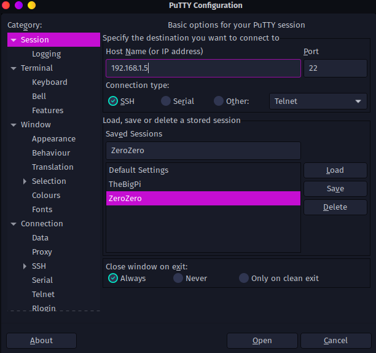

# Raspberry Pi SSH
This guide goes over how to SSH into a Raspberry Pi using PuTTy.

In order to run our data acquisition program, we will use a handy Pi Zero as it is tiny and can fit into the robot while it is driving, and a laptop does not have this "being small" functionality.

1. Plug in the Raspberry Pi Zero and ensure the green light is on. At the time of writing, the only Pi Zero available is 'zerozero'. This may differ in the future, there should be a label on your Pi telling you the name of it. It will follow the naming scheme of 'zerozero', 'zeroone', 'zerotwo', etc. 
  
  
	
2. Download and install PuTTy, a common SSH client: https://putty.org/

3. Open PuTTy. Refer to the "Address Reservation" list from Router Setup for the IP address of the Pi you want to connect to, and enter it into the "Host Name (or IP Address)" box. If Port is not set, default to 22.

	
	*Pro Tip: you can save IP addresses and load them so you don't have to refer to the Address Reservation later!*

4. Click "Open". You will be sent to this screen: 
5. Enter the username after "login as: ". The username is the same name as the label and the one listed in Address Reservation from `Router Setup.md`. In our case, it will be 'zerozero'. 
6. When prompted for the password, it should be on the back of your Pi. In our case, it will be 'rhysisfine69'. You will then be sent to the Linux terminal for the Pi Zero!
	 