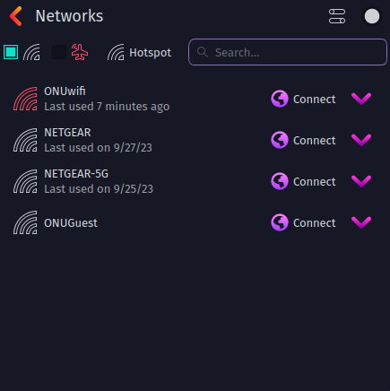
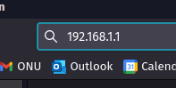
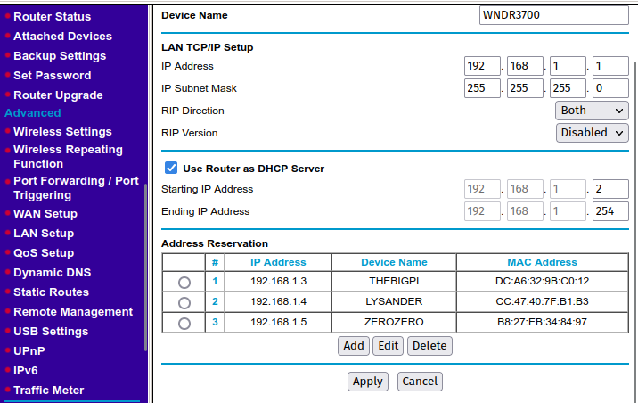
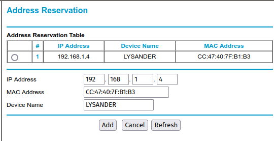
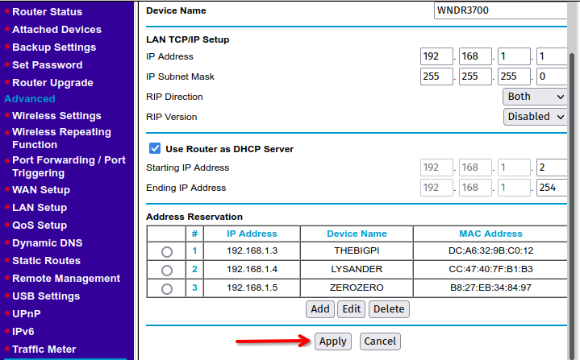

# Router Setup
This guide goes over the basics of address reservation on routers. It allows us to setup our router properly for SSH'ing into a Raspberry Pi.


To begin using the data acquisition program, we need to setup our NETGEAR router in order to SSH into the Raspberry Pi.

1. Make sure the NETGEAR router is plugged in and the "2.4GHz" light is on. Using a laptop, connect to the NETGEAR router using WiFi:
	
	*(Example of WiFi list on Garuda Linux, this may differ with your system)*

2. Using a web browser, type "192.168.1.1" into your URL bar:

	
	
3. If prompted for username and password, enter the following:
```
Username: admin
Password: password
```

4. Click "LAN Setup" on the left and you will find yourself here:
	
	
5. Under address reservation, click "Add". You will find a list of the currently connected devices to the router. Find your device from the list and copy the corresponding information:

	
	
6. Return to the "LAN Setup" menu and click "Apply". 
	
	
7. We have now successfully reserved the IP address for your computer, and it will always maintain the same local IPv4 address, making it much easier to connect with. Repeat this process if the Raspberry Pi you want to connect to is not listed under "Address Reservation."