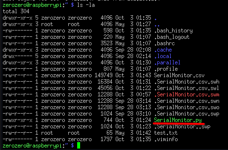

# Serial Monitor Program
## Overview
This guide goes over the basics of how to get the standalone data acquisition program up and running a Raspberry Pi without a web interface. Be sure to read these beforehand:
- [Router Setup](./router-setup.md)
- [Raspberry Pi SSH](./raspberry-pi-ssh.md)
- [FileZilla](./filezilla.md)

## Instructions
1. On GitHub, you will find a repository titled `PR-Data-Aq`. Under this repository you want to download the latest release of `SerialMonitor.py` from the `standalone` branch.
2. Using FileZilla or any other file transfer means, copy `SerialMonitor.py` from your computer into the Pi's home directory:


	
3. Run the program using the following command:
```bash
python ./SerialMonitor.py
```

4. The program will begin running and will ask you for the name of the file you want to output to.
	- ==Do not include an extension, `.csv` will be added for you.==

6. The data acquisition will commence. Once you are finished with your tests, hit `ENTER` on your keyboard to immediately terminate the program.

7. The `.csv` file containing your data  will be outputted into your home directory.

8. You can download this `.csv` to your computer using FileZilla.