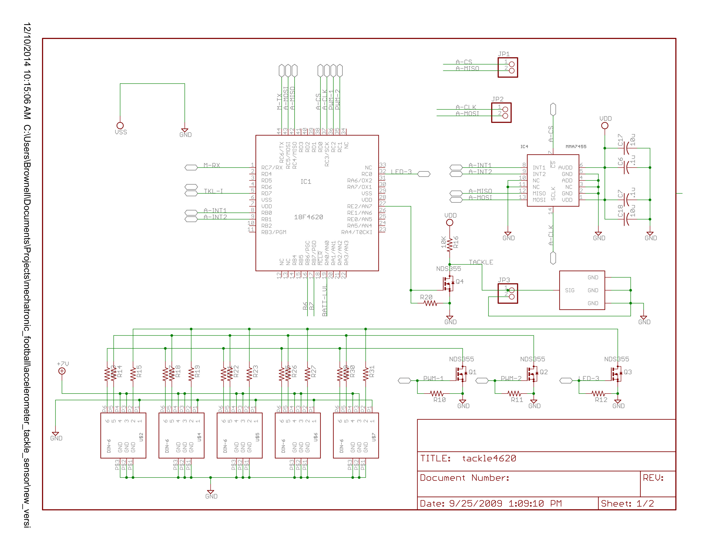
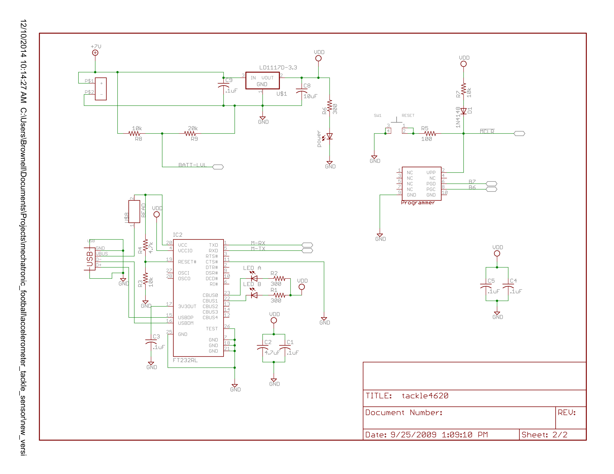
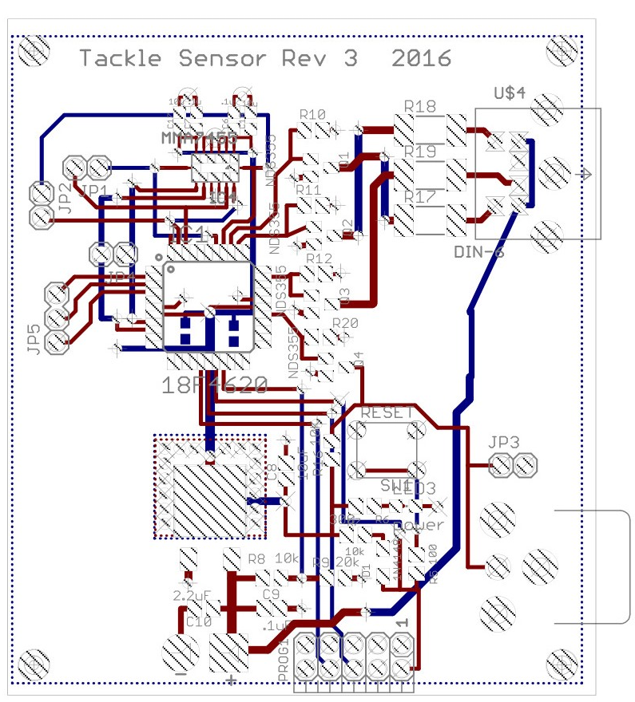

# Old Tackle Sensors (Rev3)
## Diagrams

## Rules related to tackle sensor and LEDs:
1. A specified digital accelerometer (tackle sensor) is required to sense if an upsetting event (knockdown, fall down, or tackle) has occurred. The code determining if an upsetting event has occurred, based on the accelerometer's output, will be provided. The tackle sensor must be rigidly mounted in a horizontal orientation to a horizontal interior surface of each Player's base plate in a manner that enables a trainer to manually activate the reset button on the tackle sensor within 10 seconds and a cable to be attached to reload the tackle sensor software within 1 minute. The tackle sensor must also be mounted so that when the unit faces directly downfield, the tackle sensor is square to the end zone.
    - Only the quarterback, wide receivers, and running backs will be required to have tackle sensors. Other units do not require tackle sensors, but any unit that carries the ball will be required to have a tackle sensor regardless of that unit's functional designation. Any violation of this rule results in an "ineligible player" violation and a 5 ft penalty.
    - Only Players with tackle sensors may advance the ball.

2. At least one single multi-color, high-intensity LED light, viewable from all directions, is to be used to indicate Player status. During normal play, each Player on the field will display a designated color for identification and status.
    - A player in "go" status shall have a GREEN light visible from all directions.
    - A Player in possession of the ball is tackled when an upset-event has been detected by the tackle sensor and activates the RED light, which shall remain lit for 2-seconds minimum.
    - Offensive Linemen must be clearly distinguished by a BLUE light visible from all directions so referees can determine eligibility. Offensive Linemen must be within 6 feet on either side of the ball and on the line of scrimmage at the snap.
