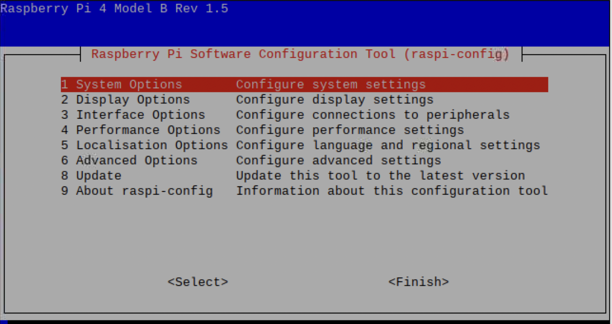
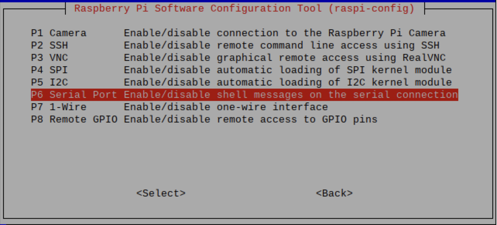
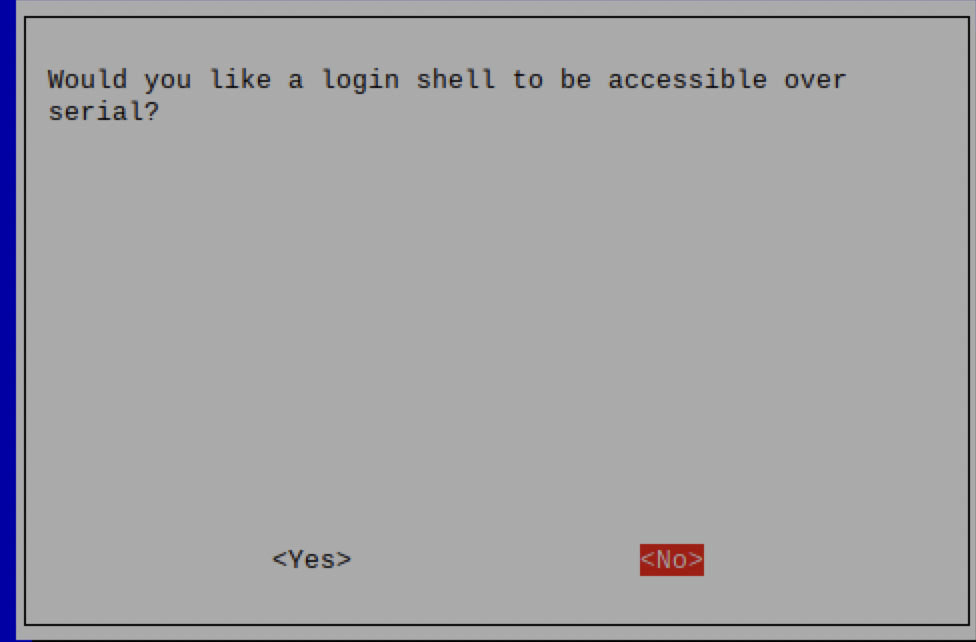

# TODO: Add General Overview about UART 

# Enabling UART on a Pi Pico Zero W / Pi 4
You can check if UART is enabled by searching through your available ports and looking for a port ending in "S0"
See the figure below for an example of how to check this

If the port isn't found, you must run 'sudo raspi-config' to enter the Raspian configuration screen to enable the firmware, which brings you to following screen:

From there, you must navigate to "Interface Options" and then "Serial Port," using the arrow keys for navigation and the ENTER key for selection.

Select "no" for the first option, 

Then "yes" for the second.

The following screen should result. 

When prompted to reboot, select 'yes.' If you're not prompted to reboot, hit the TAB key twice and press ENTER to select 'Finish.' 

Once the device reboots you should now be able to find the "S0" port mentioned earlier. This is the port used for UART communication via the TX and RX GPIO pins present on the Pi.

# Interfacing with UART through pigpio
Uart communication on [Raspbian](https://www.raspbian.org)-based Pi systems can be achieved through use of the [pigpio library](https://abyz.me.uk/rpi/pigpio/), available as both a Python module and a C library. 

To run pigpio-based programs with Python in Raspbian, you must first launch the pigpio daemon with the commannd 'sudo pigpiod'

To use pigpiod in your Python program, simply import the module and initalize an object of the pigpio class.
[pigpio instantiation](../_static/images/hardware/UART/pigpio.png)

Documentation for pigpio can be found at the site hyperlinked above.