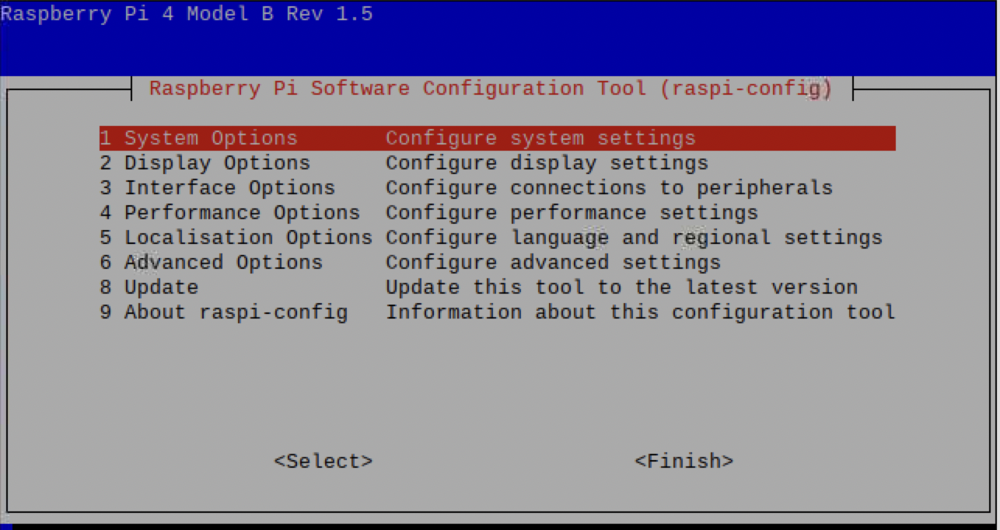
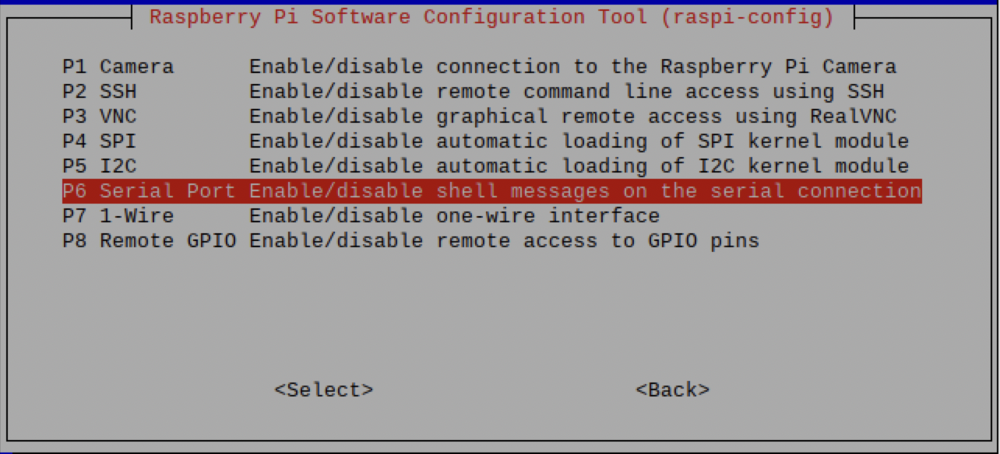
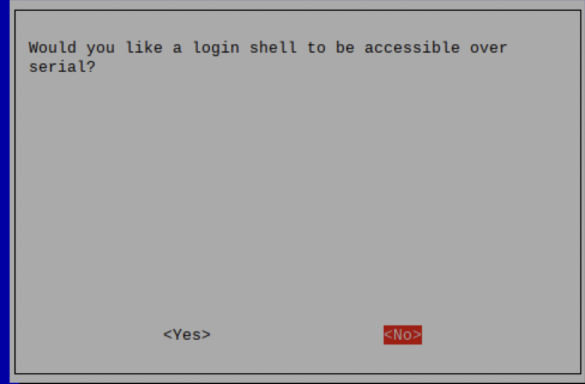
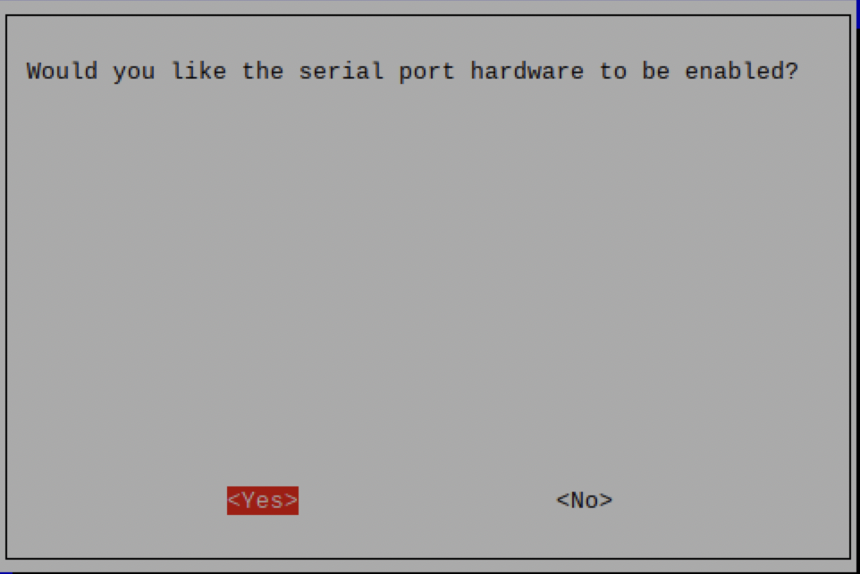
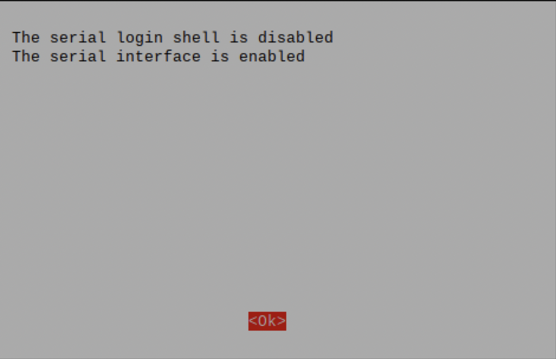
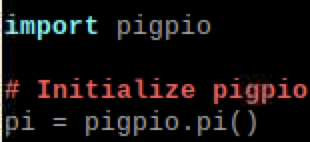
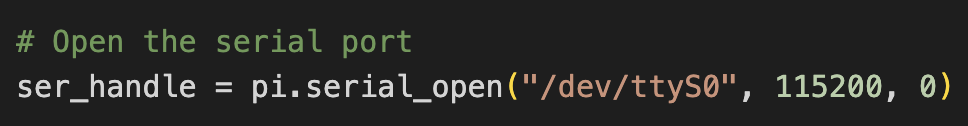

# The UART Protocol
## Overview
- UART is the Universal Asynchronous Receiver-Transmitter protocol, which is an OSI Layer 2 serial communications protocol. 
	- It is byte level and little-endian, sending and thus receiving the least significant byte first in a given transmission. 
	- However, most libraries built for UART communication will parse the data as expected.
- Any UART circuit between two devices requires three wires; a common ground, a TX to RX connection, and an RX to TX connection.

% TODO: add image of an example circuit

## UART Communication with ESP32
- With the PlatformIO Arduino framework, the ESP32 can utilize the [HardwareSerial](https://github.com/arduino/ArduinoCore-avr/blob/master/cores/arduino/HardwareSerial.h) library to establish UART communication and read/write data over the serial bus. 
- An ESP32 generally has three available UART interfaces, `UART0`, `UART1`, AND `UART2`.
- `UART1` is used by the ESP's serial monitor by default, and the pins `UART1` is generally reserved for flash memory, leaving `UART2` as the primary UART channel available. 
	- It is worth noting that pin definitions for the UART channels can vary by model, so it is important to consult the documentation for the specific board you are working with.

% TODO: @quantum check this last part – doesn't seem consistent. Is UART0 used for the serial monitor? and "the pins UART1" doesn't make sense. Is UART1 a pin? Or is it supposed to be "the pins used for/by UART1"?

## UART Communication with Pi Zero or Pi 4 
- You can check if UART is enabled by searching through your available ports and looking for a port ending in `S0`.
	- See the figure below for an example of how to check this.

% TODO: where is this figure? @quantum

- If the port isn't found, you must run `sudo raspi-config` to enter the Raspbian configuration screen and enable the firmware. This brings you to following screen:

- From there, you must navigate to `Interface Options` and then `Serial Port`, using the arrow keys for navigation and the `ENTER` key for selection.

- Select `<No>` for the first option.

- Then select `<Yes>` for the second.

- You should then see the following screen:

- When prompted to reboot, select `yes`. If you're not prompted to reboot, hit the `TAB` key twice and press `ENTER` to select `Finish`. 
- Once the device reboots, you should now be able to find the aforementioned `S0` port.
	- This is the port used for UART communication via the `TX` and `RX` GPIO pins present on the Pi.

## Interfacing with UART through pigpio
Uart communication on [Raspbian](https://www.raspbian.org)-based Pi systems can be achieved through use of the [pigpio library](https://abyz.me.uk/rpi/pigpio/), available as both a Python module and a C library. 

To run pigpio-based programs with Python in Raspbian, you must first launch the pigpio daemon with the commannd `sudo pigpiod`

To use pigpio in your Python program, simply import the module and initalize an object of the pigpio class.

Documentation for pigpio can be found at the site hyperlinked above.

## ESP32 to Pi Zero / 4 Communication
Communication between an ESP32 and a Pi Zero over UART is relatively straightforward, as both devices have robust libraries to facilitate UART communications.

A system created for testing this communication can be currently found in the PR-Encoder-Submodule-ESP32 repository, under the pi4_uart branch.

The ESP32's code waits for a user to input a message to send. It then determines the length of the message in characters, which correspond to bytes. This number is then transmit to the Pi, as the pigpio module requires a specification of how many bytes it expects to receive for a given message, or else it defaults to expecting 1000 bytes, according to the documentation avaialable [here](https://abyz.me.uk/rpi/pigpio/python.html#serial_read) 

Allowing this default value doesn't seem to pose any real issues based on the basic testing conducted thus far, but is highly inefficient. 

It then sends the message itself, and waits for a message to be sent by the pi, and finally displaying this message before the program finishes. Though it is an embedded program, running as a loop, multiple flags are used to make the code only run once in a defined sequence of events, requiring the board to be reset to send new data. This is not required by any means, but simply makes testing communication more convenient.

On the Pi side, a "serial handle" is created by specifying the UART port, baudrate, and an optional 'serial flag' parameter. This handle is passed as a parameter to all subsequent UART reading/writing function calls.

More information can be found [here](http://abyz.me.uk/rpi/pigpio/python.html#serial_open). 

The script was written to wait for the first message to be sent (the number of bytes to expect for the subsequent message, in this case). Reading this byte number itself requires a number of expected bytes to be specified, and to avoid using the default value of 1000 a sensible value of 32 is hardcoded into the function call.

Pigpio's `serial_read` returns two values, a count of the number of bytes read and the data itself, stored in a bytearray. For the sake of this demonstration program, the byte count received is parsed into an integer value, and this value is then used for the next `serial_read` function call, which receives the message specified by the user interfacing with the ESP32. This message data is then parsed into UTF-8 encoding and printed as terminal output by the python program.

Finally, the script sends a decoded string (defined within the program) as an acknowledgement message.  
