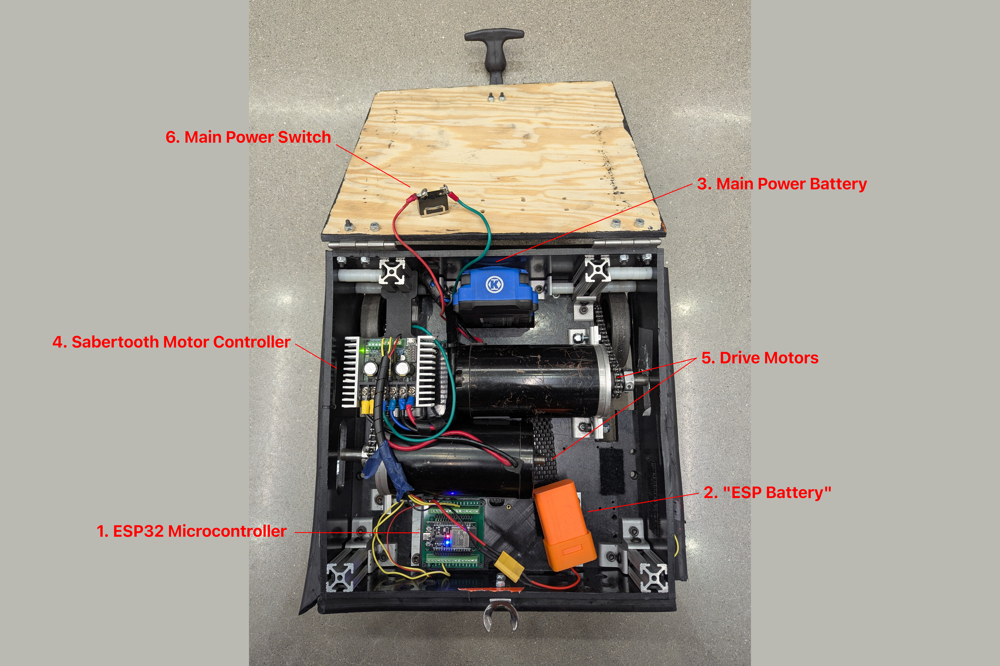

describe the different components and subsystems of the robot here (from a practical perspective), including the two types of batteries and the ESP LEDs.

# Robot Components and Subsystems
## Overview
- Broadly speaking, all robots we use have at least these key electrical components:
  1. [ESP32 Microcontroller](#esp32-microcontroller)
  2. ["ESP Battery"](#esp-battery)
  3. [Main Power Battery](#main-power-battery)
  4. [Sabertooth Motor Controller](#sabertooth-motor-controller)
  5. [Drive Motors](#drive-motors)
  6. [Main Power Switch](#main-power-switch)
- Some robots have additional sensors or actuators which are programmed via specialized subclasses of the base `Robot` class.
  - Notable examples include the Quarterback V3 or the Center V2.
  - Robots capable of legally carrying the football must typically be equipped with a [tackle sensor](#tackle-sensor).

### Component Diagram
Below is an image of a standard lineman with the aforementioned electrical components marked.

{w=700px align=center}

## Component Descriptions
### ESP32 Microcontroller
```{seealso} 

More information on this component can be found at the main article: [ESP32](../hardware/esp32)
```

The ESP32 microcontroller is the "brain" of the robot and serves as the main processing hub for driver control inputs from the [PS5 controller](../training/pairing).

### "ESP Battery"
- An 18650 Lithium Cell 7.7V battery pack powers the [ESP32 microcontroller](#esp32-microcontroller) exclusively.
  - This battery is electrically separated from the rest of the robot save for any interface wires between the ESP and other electrical devices.
- Note that unlike the [main power battery](#main-power-battery), this does *not* have a [switch](#main-power-switch) - once plugged in, the ESP32 will turn on immediately.
- Some older robots do not have this battery, and instead have the [ESP32 microcontroller](#esp32-microcontroller) connected to the [main power battery](#main-power-battery)

### Main Power Battery
- The remainder of the robot (including the [drive motors](#drive-motors) and [Sabertooth](#sabertooth-motor-controller)) are powered by the *main power battery* (or just "battery").
  - For most robots, this is a Kobalt 24V Drill Battery.
  - For certain robots (the running backs or the Quarterback V3), it is be a 12V sealed lead-acid (SLA) battery.

### Sabertooth Motor Controller
```{seealso}

More information on this component can be found in its main articles: [ST 2x25](../hardware/sabertooth-2x25.md) and [ST 2x32](../hardware/sabertooth-2x32.md).
```

- The Sabertooth motor controller is what converts the PWM signal from the [ESP32 microcontroller](#esp32-microcontroller) into a DC voltage sent to the motors.
  - This is a 24V device and runs off of the [main power battery](#main-power-battery).
    - Robots that use a 12V SLA battery as their main power battery typically have a different type of motor controller, usually integrated into ([Falcons](../hardware/falcons)) or attached to ([NEOs](../hardware/neos)) the motor.
  - There are two different types of Sabertooth motor controllers: the [2x25](../hardware/sabertooth-2x25.md) and the [2x32](../hardware/sabertooth-2x32.md).

### Drive Motors
- The drive motors are mechanically attached to the wheels of the robot, typically via a geartrain, and serve as the robot's primary method of locomotion.
- Usually these are AmpFlow motors, of which we have three types, all 24V:
  - "Big" - AmpFlow E30-400-24
  - "Small" - AmpFlow E30-150-24
  - "Pancake" - AmpFlow P40-350-24
- Other motor types include:
  - [Falcon 500](../hardware/falcons) (12V, used in the running back `C` and the turret of the Quarterback V3)
  - [NEO Vortex](../hardware/neos) (12V, used in the running back `1.21`)
  - Torquenado (12V, used in the mecanum center and V1 linemen)

### Main Power Switch
- This mechanical switch controls whether the [main power battery](#main-power-battery) is actively supplying power to the [drive motors](#drive-motors), [motor controller](#sabertooth-motor-controller), and other subsystems (if applicable).
- Various different types of power switches are used (from flip-switches to rotating switches). However, they are all typically clearly visible and accessible near the edge of the robot.
- Notably, the Quarterback V3 has two power switches, one for the top and one for the bottom (since they are technically two separate robots).

### Tackle Sensor
- Ball-carrying robots are usually required to carry a tackle sensor, which is a fancy accelerometer that triggers the lights to change to red when the robot is impacted (or, in [some](../hardware/falcons) [cases](../hardware/neos), increases rapidly in speed).
- We have [revision 3](../hardware/tackle-sensor-rev3) and [revision 4](../hardware/tackle-sensor-rev4) tackle sensors.