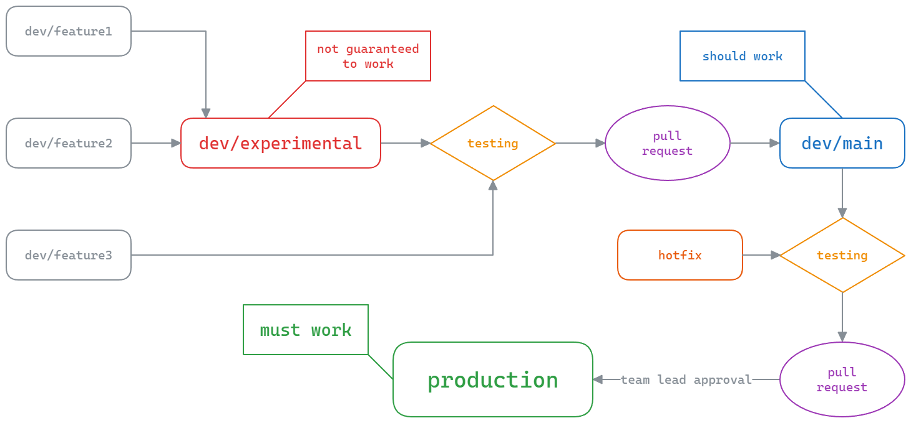

# Git and GitHub Guidelines
## Overview
- This document contains rules that are to be followed when working with the primary codebase repository, `ESP32PRCodebase`, and to the extent applicable, other repositories under the PolarRobotics GitHub Organization as well.
- This document primarily focuses on branches, particularly commit guidelines, naming conventions and merging procedures.

### Workflow Diagram

## Branches
- There are two primary categories of branches: [production](#production) and [development](#development).

### Production
- `production` is a single branch that is (supposed to be) guaranteed to contain a stable, well-tested version of the codebase.
	- In the past, this has on many occasions not been the case. This document seeks to ensure that does not happen again by implementing stringent [testing](#testing) requirements, among other regulations.

#### Rules for the `production` branch
- At any given time, the code present on this branch can be uploaded to any robot of any type and **must** function.
- When not in active use for development or testing, all robots shall have `production` code flashed by default at all times.
	- In other words, make sure to re-upload `production` when you are done testing.
- Changes to `production` may **only** be submitted via pull request, and **must** be reviewed by the programming team lead.
	- Changes to `production` should also *only* be merged in from `dev/main` save for rare hotfixes.
- Changes to `production` must be **rigorously tested** as described in the [testing](#testing) section.
- Discrete versions of production code are to be labeled with the format `prod-x.y.z` where `x.y.z` is a [semantic versioning](https://semver.org/) identifier.
- Code must be formatted as detailed in the [programming style guide](./programming-style-guide).
- Code must be appropriately documented.
	- At minimum, expected behavior of functions and intent of variables must be briefly described.

### Development
- Branches prefixed with `/dev` represent projects or features in active development.
- The two primary development branches are `dev/main` and `dev/experimental`.
	- `dev/main` is expected to be reasonably stable and to have been tested reasonably well.
	- `dev/experimental` is expected to build with no errors, but may have untested code.
		- All code from `dev/experimental` must be tested before being merged into `dev/main`.
- When creating a new branch, you:
	- should branch from `dev/main` or `dev/experimental`.
	- must name it in accordance with the following [naming conventions](#naming-conventions).

#### Naming Conventions
- Development branches shall be prefixed with `dev/`.
- The subtitle slug following the `/` (for example `my-feature` in `dev/my-feature`) shall be formatted in lower kebab case.
	- If two major features are combined in the branch, it is advisable to use a plus to indicate this, such as `dev/feat1+feat2`. However, this should be an uncommon occurrence.
	- The subtitle slug shall be concise yet descriptive. If you are uncertain as to what to title your branch, consult the team lead.

## Committing
- You are expected to make **frequent** and **well-documented** commits.
	- It is permissible to commit non-working code to a feature branch so long as anyone else working on that branch is aware.
	- At the very least, commit your changes at the end of each meeting. You *should* commit more often depending on your progress.
- Commit messages should be concise and descriptive. Descriptions should be comprehensive and detailed.
	- Anyone should be able to understand your changes at a high level by looking at the commit message alone. If you can't sum it up in 100 characters, you should probably be making separate commits.
		- You can use GitHub Desktop's partial change selection abilities to great effect for making fine-grained commits.
	- Be sure to specify what robot type the changes were made to (ex. lineman, quarterback, etc.)

## Merging
- Merges and rebases shall be **frequent**. 
	- Your feature branch should never be in a state where it would take more than 15 minutes to merge your changes into `dev/main`.
- *Fetching* and *pulling* frequently is **mandatory**.
	- You must constantly be monitoring the repository for new changes to `dev/main` and rebase as soon as possible. 
		- This takes priority over immediate progress. Do **NOT** let branches drift far from each other.
- Regularly submit pull requests to `dev/main` or `dev/experimental`. Test your code on a robot at key points throughout development. 

## Testing
- All code changes are expected to be tested at some point in their lifecycle, ideally as soon as possible, and at the latest before being merged into `dev/main`.
- Below is a list of requirements for any code being merged into `dev/main` or `production`.

### Testing Requirements
- All environments must build with zero errors.
- The code must be tested for every type of robot and exhibit expected functionality.
	- For example, if a particular mechanism was not yet programmed, and it did not function, this would be allowed. However, if the mechanism was programmed, and did not function, this would fail.
	- The only exception is if the team lead deems that the changes would not affect a particular type of robot.
		- For example, changes that affect only the quarterback need not be tested on the center.
- For robots capable of carrying the football, the tackle sensor must be functional.
	- Robot LEDs must also be functional in conjunction with the tackle sensor.
- Controller pairing must be functional.
