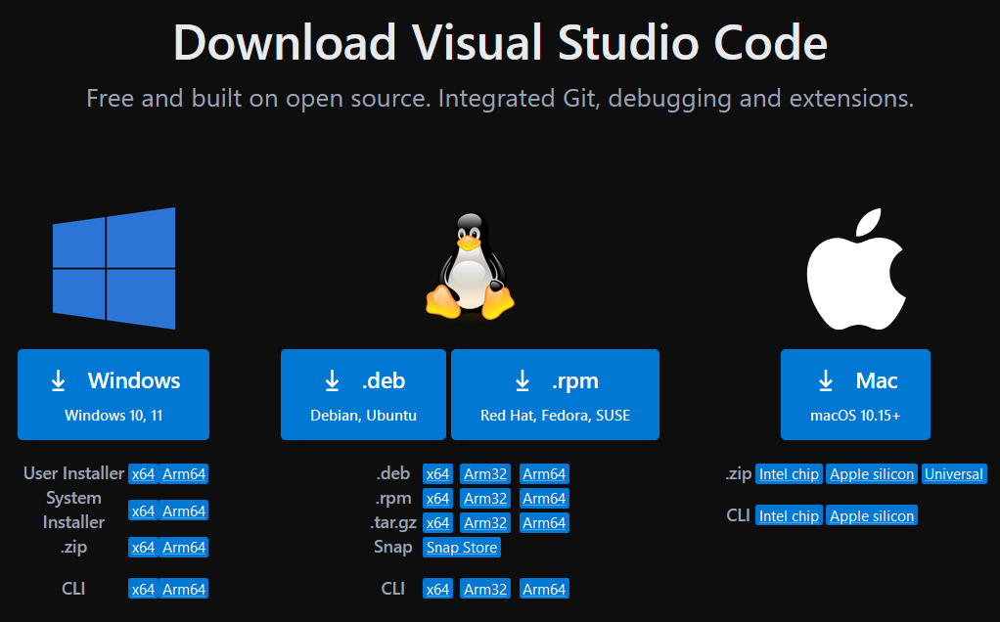
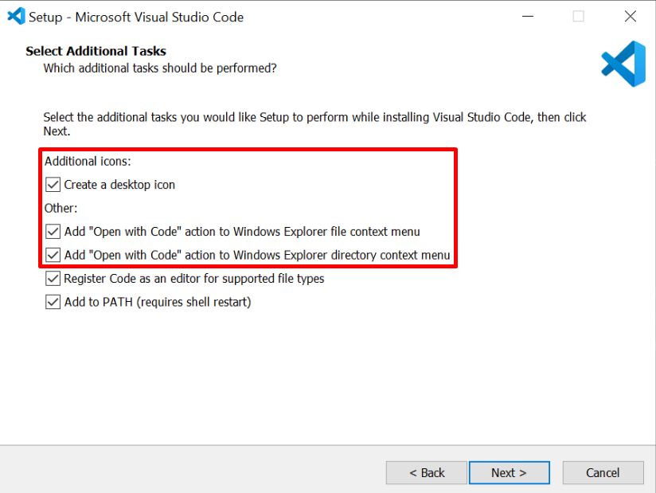
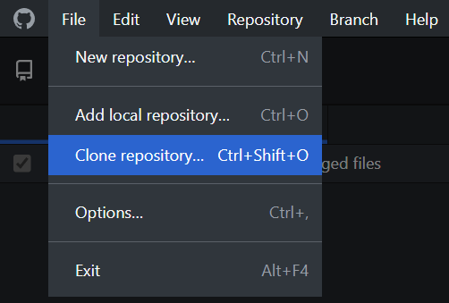
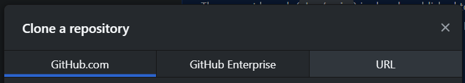
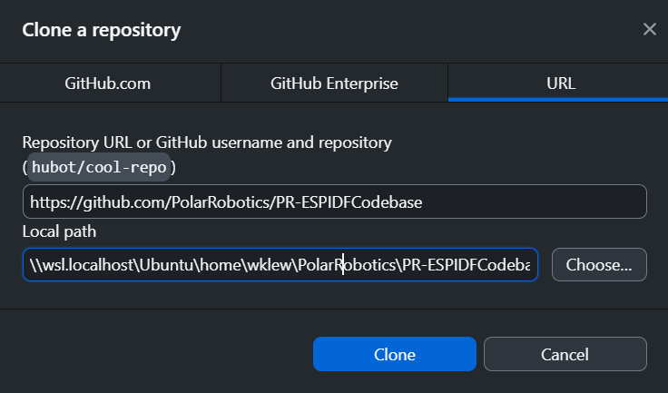
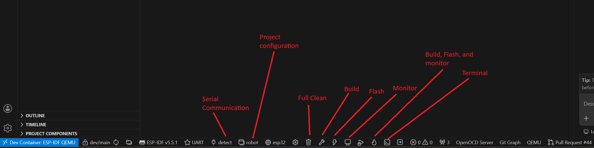

# Development Environment Setup - Windows

## Overview

- In this tutorial, you will install Visual Studio Code with the Dev Container and other extensions necessary to work with the Polar Robotics codebase. Finally, you will compile and build the project to prepare for the next step – [uploading code to a robot](./uploading-code).

### Prerequisites

- Access to a computer running Windows 10/11 with an internet connection
- Completion of the [Git Training](./git), and by extension:
  - A completed installation of Git
  - A GitHub account
- Completion of the [Docker Training](./docker)
  - You must have Docker running to open the codebase within the Dev Container.
  - YOU MUST USE THE DEV CONTAINER!

## Installing Visual Studio Code

1. If you have administrator privileges on your computer, click this link to download the system-level VSCode installer (recommended): <https://code.visualstudio.com/sha/download?build=stable&os=win32-x64>

- Otherwise, download the user-level VSCode installer from [https://code.visualstudio.com/Download](https://code.visualstudio.com/Download) <br> {w=500px}

1. Run the installer.
2. Select `I accept the agreement`, then click `Next`.
3. If desired, change the installation directory. You may leave it at the default location. Click `Next`.
4. On the `Select Start Menu Folder` page, click `Next`.
5. It is strongly recommended to **check all boxes** on the `Select Additional Tasks` page. <br> {w=400px}
6. Then, click `Next`.
7. Click `Install`.
8. Wait for VSCode to install.
9. Click `Finish`.

## Cloning the Polar Robotics repository

### Command-Line

- If you are comfortable with the Git command-line interface, you can simply run the command below from your desired parent directory.

```sh
git clone https://github.com/PolarRobotics/PR-ESPIDFCodebase
```

### Graphical

1. Copy the link below. Tip: hovering over the top right of the codeblock will reveal a button you can click to copy the contents of the codeblock to your clipboard.

```
https://github.com/PolarRobotics/PR-ESPIDFCodebase
```

1. Open GitHub Desktop.
2. Click `File -> Clone repository...` <br> {w=250px}
3. Switch to the `URL` tab on the right. <br>{w=400px}
4. In the first box (hint text `URL or username/repository`), paste the URL you copied earlier. <br> {w=400px}

- Alternatively, you can simply type `PolarRobotics/PR-ESPIDFCodebase`.

- Next, change the directory to `\\wsl.localhost\Ubuntu\home\<your-username>\PolarRobotics\PR-ESPIDFCodebase` (replace `<your-username>` with your WSL username).
  - If you don't know your WSL username, you can open a WSL terminal by opening Command Prompt, running `wsl` to enter WSL terminal, and then runing the command `echo $USER` to find out.
  - The repository must be cloned within WSL, or disk operations will be extremely slow. This is because the Dev Container runs in a Linux environment, so it can only access files within WSL. If you clone the repository to a location outside of WSL, such as your Windows user directory, then the Dev Container will have to access those files through a network share (`\\wsl$\`), which is very slow for disk operations.

1. Click `Clone`, and wait for Git to clone the repository from GitHub.

## Installing ESP32 USB Drivers

1. Navigate to this site: [https://www.pololu.com/docs/0J7/all](https://www.pololu.com/docs/0J7/all).

- Basically you will need to follow the instructions on this site.
- For Windows, the link on the site will download the drivers for you directly.
  - Alternatively, you can visit the download page here: [https://www.silabs.com/developers/usb-to-uart-bridge-vcp-drivers](https://www.silabs.com/developers/usb-to-uart-bridge-vcp-drivers)
- For Mac, the link on this site is out of date and will direct you to the main homepage of Silicon Labs. You can search for the drivers from here, or just use the link above.

## Building the Project

1. At the bottom of the VSCode window, you will notice a status bar containing several things: <br> 

- Of these, the most important are:
- **Current Git Branch** – This is a quick switcher that allows you to swap between branches while in VSCode. There is also more Git integration that allows you to commit and push, but it is strongly recommended to use GitHub Desktop so that you can methodically commit your changes.
- **PlatformIO Build** – This button initiates the build process, i.e., compiles the codebase.
- **PlatformIO Build and Upload** – This button will perform the build process. If successful, PlatformIO will then attempt to upload the code via the selected serial port.
- **Serial Monitor** – When connected to an ESP32 via a USB cable, this allows you to view debug output.
- **PlatformIO Build Environment** – Detailed in the next step.
- **Selected Serial Port** – When you are connected to one or more ESP32s (or similar devices) via USB cable(s), this menu will allow you to select which port to use. Typically, the `Auto` setting works, but sometimes you may have to select the port manually in order to upload to the ESP32.

1. Change the build environment from `Default` to `env:robot`. When clicking the `Default (PR-ESPIDFCodebase` text, a dropdown menu will appear at the top. Select `env:robot`.

- The `Default` step will build all environments. You generally do not want to do this.
- This should generally be set to `env:robot` for general code compilation and uploading. Usage of `env:write_bot_info` and `env:read_bot_info` is covered in the (next) tutorial for [uploading code to a robot](./uploading-code).

1. PlatformIO will automatically run some tasks to change the project configuration. Once you see `Project has been successfully updated!` in the console output, **click the Build button** (the checkmark in the bottom taskbar).
2. After some time (typically 20-60 seconds depending on your computer), you should see a `[SUCCESS]` message. If your build fails the first time, please consult the team lead or another senior developer for assistance.
