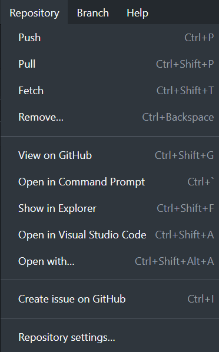
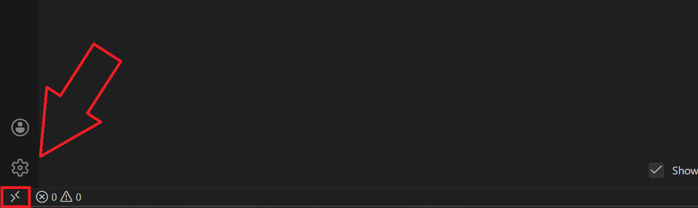
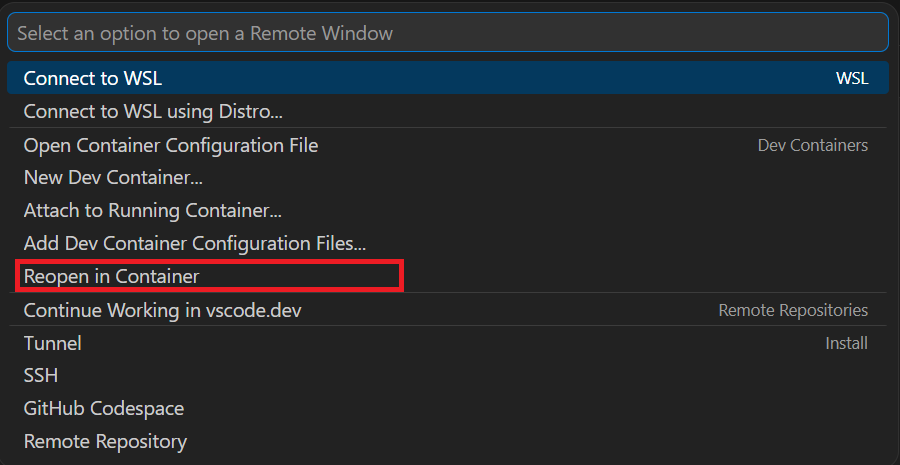

# Development Environment Setup - Windows

## Overview

- In this tutorial, you will install Visual Studio Code with the Dev Container and other extensions necessary to work with the Polar Robotics codebase. Finally, you will compile and build the project to prepare for the next step – [flashing code to a robot](./uploading-code).

### Prerequisites

- Access to a computer running Windows 10/11 with an internet connection
- Completion of the [Git Training](./git), and by extension:
  - A completed installation of Git
  - A GitHub account
- Completion of the [Docker Training](./docker)
  - You must have Docker running to open the codebase within the Dev Container.
  - YOU MUST USE THE DEV CONTAINER!

## Installing Visual Studio Code

1. If you have administrator privileges on your computer, click this link to download the system-level VSCode installer (recommended): <https://code.visualstudio.com/sha/download?build=stable&os=win32-x64>

- Otherwise, download the user-level VSCode installer from [https://code.visualstudio.com/Download](https://code.visualstudio.com/Download) <br> {w=500px}

1. Run the installer.
2. Select `I accept the agreement`, then click `Next`.
3. If desired, change the installation directory. You may leave it at the default location. Click `Next`.
4. On the `Select Start Menu Folder` page, click `Next`.
5. It is strongly recommended to **check all boxes** on the `Select Additional Tasks` page. <br> {w=400px}
6. Then, click `Next`.
7. Click `Install`.
8. Wait for VSCode to install.
9. Click `Finish`.

## Cloning the Polar Robotics repository

### Command-Line

- If you are comfortable with the Git command-line interface, you can simply run the command below from your desired parent directory.

```sh
git clone https://github.com/PolarRobotics/PR-ESPIDFCodebase
```

### Graphical

1. Copy the link below. Tip: hovering over the top right of the codeblock will reveal a button you can click to copy the contents of the codeblock to your clipboard.

```
https://github.com/PolarRobotics/PR-ESPIDFCodebase
```

1. Open GitHub Desktop.
2. Click `File -> Clone repository...` <br> {w=250px}
3. Switch to the `URL` tab on the right. <br>{w=400px}
4. In the first box (hint text `URL or username/repository`), paste the URL you copied earlier. <br> {w=400px}

- Alternatively, you can simply type `PolarRobotics/PR-ESPIDFCodebase`.

- Next, change the directory to `\\wsl.localhost\Ubuntu\home\<your-username>\PolarRobotics\PR-ESPIDFCodebase` (replace `<your-username>` with your WSL username).
  - If you don't know your WSL username, you can open a WSL terminal by opening Command Prompt, running `wsl` to enter WSL terminal, and then runing the command `echo $USER` to find out.
  - The repository must be cloned within WSL, or disk operations will be extremely slow. This is because the Dev Container runs in a Linux environment, so it can only access files within WSL. If you clone the repository to a location outside of WSL, such as your Windows user directory, then the Dev Container will have to access those files through a network share (`\\wsl$\`), which is very slow for disk operations.

1. Click `Clone`, and wait for Git to clone the repository from GitHub.

## Opening the Project in the Dev Container

1. From GitHub Desktop, click `Repository -> Open in Visual Studio Code` <br> {w=400px}
2. Click the Remote Window button on the bottom left of the VSCode window. It should have a icon with `><` on it. <br> {w=400px}
3. Make sure Docker is running for this step to work: Click `Reopen in Container`. This will open the project within the Dev Container, which is a Linux environment with all the necessary tools and dependencies pre-installed. <br> {w=400px}

- Sit back and relax while the container builds and sets up. This may take around 5-10 minutes, but it only needs to be done the first time you open the project in the Dev Container. The next time you open the project in the Dev Container, it should be much faster since the container will already be built.

## Building the Project

1. At the bottom of the VSCode window, you will notice a status bar containing several things: <br> 

- Of these, the most important are:
- **Current Git Branch** – This is a quick switcher that allows you to swap between branches while in VSCode. There is also more Git integration that allows you to commit and push, but it is strongly recommended to use GitHub Desktop so that you can methodically commit your changes.
- **Select Port to Use** – When you are connected to one or more ESP32s (or similar devices) via USB cable(s), this menu will allow you to select which port to use. Typically, the `detect` setting works, but sometimes you may have to select the port manually in order to flash to the ESP32.
- **Select Project Configuration** - This is a dropdown menu that allows you to select which environment to build. Make sure it **NEVER** says `No Configuration Selected`, it must always have a configuration selected, or you will run into build problems!
- **Build Project** – This button initiates the build process, i.e., compiles the codebase.
- **Flash Device** – This button will flash the compiled code to an ESP32 when you are connected to one via USB cable. This is covered in the next tutorial for [flashing code to a robot](./uploading-code).
- **Monitor Device** – When connected to an ESP32 via a USB cable, this allows you to view debug output.
- **Launch Debug** - When connected to an ESP32 via a USB cable, this allows you to debug code on the ESP32 with breakpoints and variable inspection.
- **Build, Flash, and Monitor Device** – This button will build the codebase, flash it to an ESP32, and open a monitor for debug output all in one step. This is a convenient option for rapid iteration.

1. Change the project configuration to `robot`. When clicking the `No Configuration Selected` dropdown, select `robot`.

- The `No Configuration Selected` step will build an incorrectly configured project. NEVER DO THIS!!!
- This should generally be set to `robot` for general code compilation and flashing. Usage of `write_bot_info` is covered in the (next) tutorial for [flashing code to a robot](./uploading-code).

1. **Click the Build Project button** (the wrench in the bottom taskbar).
2. After some time (typically 45-75 seconds depending on your computer), you should see an ESP-IDF Size output message with the size of the image. If your build fails the first time, please consult the team lead or another senior developer for assistance.
