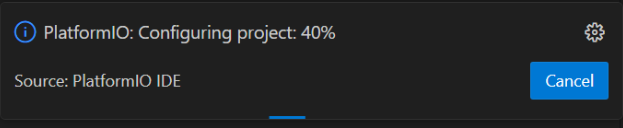

# Development Environment Setup
## Overview
- In this tutorial, you will install Visual Studio Code with the PlatformIO extension and other extensions necessary to work with the Polar Robotics codebase. Finally, you will compile and build the project to prepare for the next step – [uploading code to a robot](./uploading-code).

### Prerequisites
- Access to a computer (preferably a laptop) with an internet connection
	- Note: this tutorial is primarily aimed at Windows 10/11. If you own a Mac or Linux computer, you may have to make changes and are expected to have some idea of how to work on your own.
- Completion of the [Git Training](./git), and by extension:
	- A completed installation of Git
	- A GitHub account

## Cloning the Polar Robotics repository
### Command-Line
- If you are comfortable with the Git command-line interface, you can simply run the command below from your desired parent directory.
```sh
git clone https://github.com/PolarRobotics/ESP32PRCodebase
```

### Graphical
1. Copy the link below. Tip: hovering over the top right of the codeblock will reveal a button you can click to copy the contents of the codeblock to your clipboard.
```
https://github.com/PolarRobotics/ESP32PRCodebase
```
2. Open GitHub Desktop. 
3. Click `File -> Clone repository...` <br> {w=250px}
4. Switch to the `URL` tab on the right. <br>{w=400px}
5. In the first box (hint text `URL or username/repository`), paste the URL you copied earlier. <br> {w=400px}
	- Alternatively, you can simply type `PolarRobotics/ESP32PRCodebase`.
6. It is strongly recommended to **change the directory** (`Local path`) to **something other than** `C:\Users\YourName\Documents\GitHub`. 
	- It is recommended to create a folder on your desktop or somewhere else memorable to house all your code projects. Better yet, create a subfolder there specifically for Polar Robotics, as you will eventually use more than one repo.
	- **Note this directory for later.**
7. Click `Clone`, and wait for Git to clone the repository from GitHub.

## Installing Visual Studio Code


1. If you have administrator privileges on your computer, click this link to download the system-level VSCode installer (recommended): https://code.visualstudio.com/sha/download?build=stable&os=win32-x64
	- Otherwise, download the user-level VSCode installer from [https://code.visualstudio.com/Download](https://code.visualstudio.com/Download) <br> {w=500px}
2. Run the installer.
3. Select `I accept the agreement`, then click `Next`.
4. If desired, change the installation directory. You may leave it at the default location. Click `Next`.
5. On the `Select Start Menu Folder` page, click `Next`.
6. It is strongly recommended to **check all boxes** on the `Select Additional Tasks` page. <br> {w=400px}
7. Then, click `Next`.
8. Click `Install`.
9. Wait for VSCode to install.
10. Click `Finish`.

## Installing PlatformIO
1. If VSCode is not already open, launch it.
2. Navigate to the extensions menu on the navigation sidebar: 
3. Search for `PlatformIO`. When you find the entry depicted below (should be at the top) click `Install`. <br> {w=225px}
4. Wait for PlatformIO to install. You will see some console output at the bottom of your screen. Wait until you see "Please restart VSCode." in the output or the toast message on the bottom left. <br> 
5. Restart VSCode as requested by the IDE (just close the window normally and relaunch).
6. PlatformIO should now be installed. You should see the alien head icon on the left-hand navigation sidebar. Click on it to open the PlatformIO IDE menu: <br> {w=225px}
7. In the bottom half of the left pane, under `QUICK ACCESS`, under the `PIO Home` dropdown, double-click `Open`: <br> {w=225px}
8. Your screen should now look like the image below. This is the PlatformIO IDE homepage. 
9. Within the PlatformIO IDE main view, under **Quick Access**, select `Open Project`: <br> 
10. In the `Open PlatformIO Project` dialog that opens, navigate to the directory where you cloned our repo, `ESP32PRCodebase`. In this example, that directory is `C:\Home\Projects\ESP32PRCodebase`. <br> {w=400px}
11. Optional: Click the star icon in the top left to favorite this directory for later usage.
12. Click the `Open "ESP32PRCodebase"` button.
13. A dialog like the one pictured below may appear. Optionally, check the box to trust the parent folder. Then, click `Yes, I trust the authors`. <br> {w=350px}
14. Wait for PlatformIO to configure the project. Watch the toast in the lower right corner. This may take several minutes. <br> {w=300px}
	- You may be asked to sign into GitHub during this process. If so, a dialog will pop up. Follow the steps to sign in and then you should be able to return to VSCode.
15. The toast message should disappear once the project is configured. You may see some console output ending with `Project has been successfully updated!` – if you reach this point, you've successfully installed PlatformIO and configured the project! Now all that's left is to do a test build, then you can upload code to a robot.

## Building the Project
1. At the bottom of the VSCode window, you will notice a status bar containing several things: <br> 
	- Of these, the most important are:
		- **Current Git Branch** – This is a quick switcher that allows you to swap between branches while in VSCode. There is also more Git integration that allows you to commit and push, but it is strongly recommended to use GitHub Desktop so that you can methodically commit your changes.
		- **PlatformIO Build** – This button initiates the build process, i.e., compiles the codebase. 
		- **PlatformIO Build and Upload** – This button will perform the build process. If successful, PlatformIO will then attempt to upload the code via the selected serial port.
		- **Serial Monitor** – When connected to an ESP32 via a USB cable, this allows you to view debug output.
		- **PlatformIO Build Environment** – Detailed in the next step.
		- **Selected Serial Port** – When you are connected to one or more ESP32s (or similar devices) via USB cable(s), this menu will allow you to select which port to use. Typically, the `Auto` setting works, but sometimes you may have to select the port manually in order to upload to the ESP32.
2. Change the build environment from `Default` to `env:robot`. When clicking the `Default (ESP32PRCodebase` text, a dropdown menu will appear at the top. Select `env:robot`.
	- The `Default` step will build all environments. You generally do not want to do this.
	- This should generally be set to `env:robot` for general code compilation and uploading. Usage of `env:write_bot_info` and `env:read_bot_info` is covered in the (next) tutorial for [uploading code to a robot](./uploading-code).
3. PlatformIO will automatically run some tasks to change the project configuration. Once you see `Project has been successfully updated!` in the console output, **click the Build button** (the checkmark in the bottom taskbar).
4. After some time (typically 20-60 seconds depending on your computer), you should see a `[SUCCESS]` message. If your build fails the first time, please consult the team lead or another senior developer for assistance.