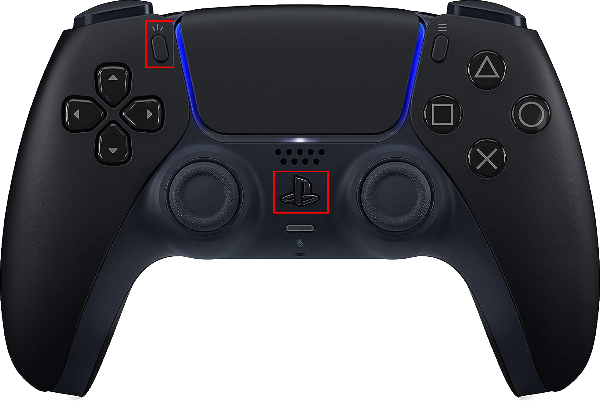

# Pairing and Connecting Controllers
## Overview
- This document details the procedure required to pair or connect a PS5 controller to the robot, assuming usage of the primary codebase repository (`ESP32PRCodebase`).

### Prerequisites
- A robot with working code [uploaded](./uploading-code) (from a branch of `ESP32PRCodebase`, typically `production`)
  - An [ESP battery](../high-level/robot-components) or other source of power (connected laptop)
    - Exercise caution if operating a robot with a connected device.
  - A [robot battery](../high-level/robot-components) (24V Kobalt drill battery)
    - Technically this is optional, but you will need it if you want your control inputs to have any effect.
- A charged and functional PS5 controller

## Procedure
- The robot's pairing code is designed to mimic the PS5 controller's pairing light sequences.

### The PS5 Controller
- To re-pair to the last device that was successfully connected to, simply press the **PS button**.
- To initiate _pairing mode_ (i.e., connect to a new device), hold the **PS button and "Share" button simultaneously for about 3 seconds** (See below). 

{w=450px}

### The Robot
#### Automatic Mode
- For the typical (current) "automatic" or "sequential" setup, at power-on, the robot will look for the last controller it successfully paired to. 
  - During this time, the [blue LED](../high-level/robot-components) will flash on and off with a 50% duty cycle, matching how the PS5 controller acts when attempting to pair to the last successful device.
  - If that controller is not found after 15 seconds, the robot will begin searching for new devices to pair to.
    - During this time, the [blue LED](../high-level/robot-components) will flash with a triple-burst pattern, similar to the PS5 controller's behavior in pairing mode.

#### Pin-Pairing Mode
- If pin-pairing mode is enabled, the robot will perform one of two actions depending on the logic level of the pairing pin upon startup:
  - If the pairing pin is `LOW`, the robot will search for the last controller successfully paired to (as described [above](#automatic-mode))
  - If the pairing pin is `HIGH`, the robot will search for new devices (as described [above](#automatic-mode))