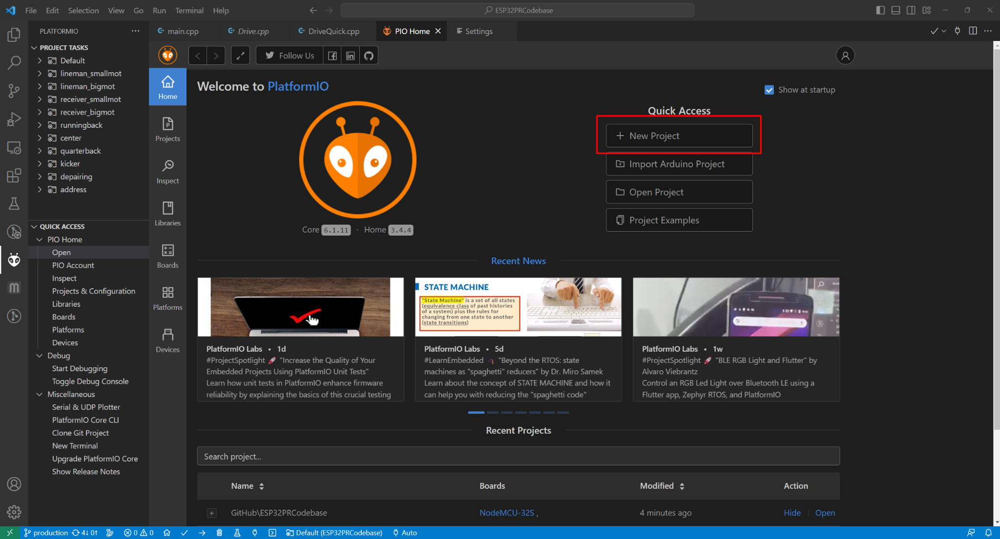
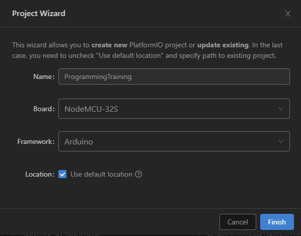
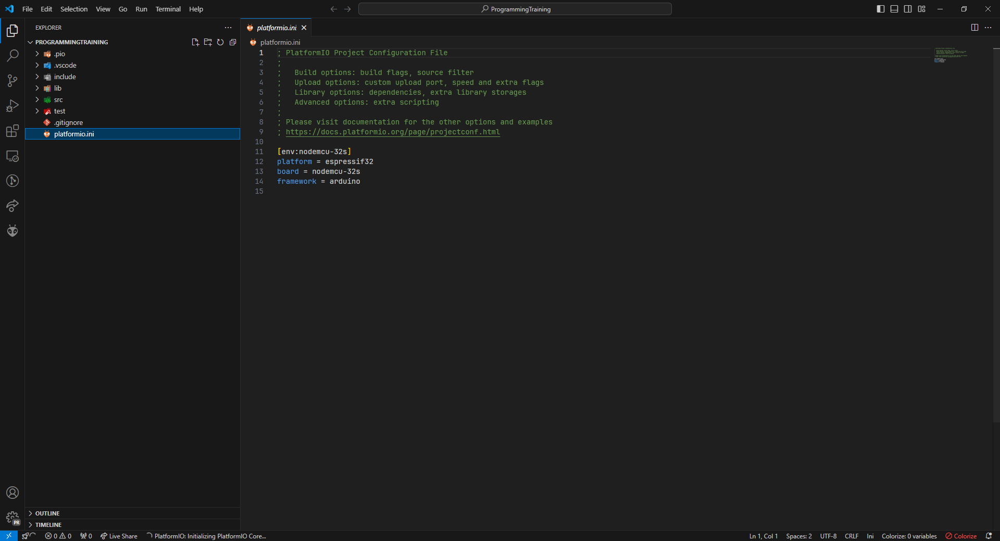
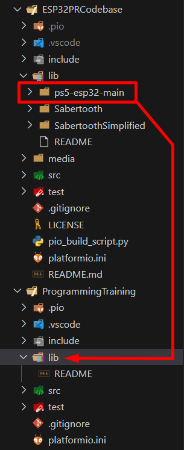

# Programming CYOA Training
## Overview
- This is a self-paced training course designed to provide you with an environment where you can quickly gain experience working with the key technologies of our robots: with ESP32, the Arduino Framework for ESP32, Bluetooth pairing, and motor controls.
- This course can be as easy or hard as you make it. There are four key objectives, and three optional challenges, along with a set of recommended steps.
- Ultimately, you do not have to do anything except achieve the four objectives. You can stop reading this page after this section and still achieve all of them (but it will be exceedingly difficult to do so, and you could break a robot). 
- Thus, there are several "hints" and/or "solutions" placed in this document, which you can choose to use if you find yourself stuck on a particular area. 
  - The only information that is revealed by default is the minimum amount of information you need in order to work with the aforementioned technologies, particularly things that are specific to "Polar Robotics" more so than ESP32 etc. in general.
  - You are expected to use the internet (Google etc.) to help you complete the programming objectives.
    - Note that the entire Polar Robotics codebase is available, and if you are very stuck you may consult it, but that somewhat defeats the purpose of this activity, and it will probably be easier to figure out how to do the task itself rather than figure out how we did it (which is likely more complex than the way you need to do it here).
  - Once you have determined a solution, it is recommended to view any hints you did not use to supplement your understanding.

```{admonition} Tip
:class: tip

Walk before you run. Build up to achieving the objectives outlined below. Try to get a proof-of-concept working first. This will make the process less frustrating and more rewarding.
```

### Hard Rules
- There are a few rules required for your safety, the functionality of the robots, and the effectiveness of this training.

1. You may work either alone or with one other person.
   - You are allowed (and encouraged) to talk to other trainees, but this rule is intended to ensure all trainees gain roughly the same amount of experience, i.e., that no one person does all the coding.
2. You may not set the motors to over 50% power. 
   - The motors used by most robots are **extremely** powerful. You can harm yourself, the robot, and the environment if you set them to full power.
3. You must initially set the motors to 0% power upon startup.
4. You may not disassemble the robot. 
   - This also means you should not remove the ESP32 from its breakout board without permission from the training manager.
5. Do not plug the ESP32 into your computer and its battery at the same time.
   - Refer to the [uploading code training](./uploading-code).
6. Turn OFF the main power switch, then power the ESP (via a battery or your computer) *before* inserting the 24V drill battery and flipping the power switch to ON.
   - If you turn on the main power (which drives the motors) before the ESP is ready, they can spin unexpectedly.
7. It is strongly recommended that until you are ready to drive the robot, you sit the robot up against something so the wheels don't touch the ground while testing, **especially** if your computer is directly connected to it.
   - Similarly to (6), you do not want the robot to go out of control.
8. Do not do burnouts on the floor. 
   - If you do, you will be responsible for cleaning it up.

### Key Objectives
1. Make the LED on the ESP32 blink with a period of 1 second.
2. Make a function to spin both drive motors at 25% power for three seconds.
3. View live output from the PS5 controller on the serial monitor. 
4. Be able to drive a lineman from a controller.

### Optional Challenges
1. Figure out how to control the motors by yourself instead of using the provided code.
2. Implement pairing by yourself instead of using the provided code.
3. Implement an acceleration curve to your drive controls.

### Recommended Progression
- Create an empty PlatformIO project.
- **O1** – Make the LED on the ESP32 blink with a period of 1 second.
- Set one motor to 25% power.
	- **C1** – Figure out how to control the motors by yourself instead of using the provided code.
- **O2** – Make a function to spin both drive motors at 25% power for three seconds.
- Temporarily comment out the motor code.
- Send any string message from the ESP to the serial monitor.
- Connect to the PS5 controller.
	- **C2** – Implement pairing by yourself instead of using the provided code.
- **O3** – Send the output of one joystick of the PS5 controller to the serial monitor.
- Make a button press of the PS5 controller trigger your "drive forward" code from before.
- Send the output of one joystick from the PS5 controller to a motor.
- Implement a control scheme.
- **O4** – Drive a robot from a controller.
- **C3** – Implement an acceleration curve to your drive controls.

## Creating a PlatformIO Project

```{tip}

PlatformIO has several example projects available from the `Project Examples` button in the Quick Access menu on the PlatformIO homepage. You may find these helpful.
```

1. Navigate to the PlatformIO homepage (alien sidebar icon, `Quick Access` pane on the left, `PIO Home` dropdown, `Open`).
2. On the right of the PlatformIO homepage, under the **Quick Access** button menu, click `New Project`. <br> 
3. Give the project an appropriate name. Then select the `NodeMCU-32S` board and the `Arduino` framework. You may optionally change the location. <br> {w=350px}
4. You may need to wait a short time, but eventually you should be greeted with a new project opened to the `platformio.ini` file as shown below:  <br> 
5. Add the following 3 lines to the bottom of `platformio.ini`, under the current last line:
```
board_build.mcu = esp32
upload_protocol = esptool
monitor_speed = 115200
```
6. Now, on the project explorer sidebar, open the `src` folder, and then `main.cpp`. You are ready to begin programming!

## Blinking the LED
- If you successfully completed the [uploading code training](./uploading-code) training, you would have seen the blue LED begin blinking as the program begins to run. In our production code, this indicates our pairing routine. For now, your goal is to make the LED blink with a period of one second (you may choose to do longer or shorter, as long as it blinks consistently while your program is running).
  - Note that the ESP also has a red LED. This is the power LED, which indicates that the ESP has power. You cannot make it flash via code. Please do not make it flash manually by rapidly plugging and unplugging the ESP. This is not the objective.
  - The LED you are trying to program is typically referred to as the "built-in LED" - this may help you find information about it.

```{admonition} Hint: Conceptual information
:class: hint dropdown

- The built-in LED is controlled via a pin on the ESP, just like any other external device (such as a motor). You will need to write a digital signal to this pin.
  - A "digital signal" means `0` or `1`, corresponding to low or high voltage, respectively.
```

```{admonition} Hint: Which pin to use
:class: hint dropdown

The pin tied to the built-in LED is aliased to the C preprocessor `#define` `LED_BUILTIN`.
```

```{admonition} Hint: What function to use
:class: hint dropdown

You can write a digital signal to a pin using the Arduino function `digitalWrite()`, which takes the pin ID (`LED_BUILTIN`) and a voltage level (`#define`d as `LOW` or `HIGH`) as arguments.
```

```{admonition} Hint: Something missing from your setup function?
:class: hint dropdown

If your loop code seems logical, but you can't get the LED to blink, you probably haven't initialized the pin. In `void setup()`, you need to call the Arduino function `pinMode()`.
```

:::{admonition} Solution
:class: hint dropdown

```cpp
void setup()
{
  // initialize LED digital pin as an output.
  pinMode(LED_BUILTIN, OUTPUT);
}

void loop()
{
  // turn the LED on (HIGH is the voltage level)
  digitalWrite(LED_BUILTIN, HIGH);
  // wait for a second
  delay(1000);
  // turn the LED off by making the voltage LOW
  digitalWrite(LED_BUILTIN, LOW);
   // wait for a second
  delay(1000);
}
```
:::

## Moving the Motors
- Your second objective involves controlling the motors. 
  - Again, you should start by trying to control one, and do not set any motor to over 50% power.
  - Also remember that you should encapsulate this in a function outside of `setup()` or `loop()`.
- There are two key pieces of information that you need in order to achieve this objective:
  1. The pins used for the lineman motors are 32 for the left motor and 33 for the right motor. They are already wired up correctly, so you only need to write your code to fit this.
  2. Controlling the motors is not as simple as the LED, nor can you simply write "0.5" to the pin to drive the motor at half power. 
     - The technology that allows us to control the motors at variable speeds is detailed in the first hint below.
     - For **Challenge 1**, you can attempt to figure out the control method by yourself. For your reference, the motors are [AmpFlow](https://www.ampflow.com/motors/highPerformance/threeInch/) `E30-150-24` (short) or `E30-400-24` (long) 3" high-performance economy motors.

```{admonition} Hint: The motor control method
:class: hint dropdown

- The motors we use in our robots are controlled via *pulse width modulation* (PWM) signals. 
  - This means that the digital signal switches between `1` and `0` at varying time intervals, in our case from 1000 to 2000 ns. 
    - Power is most negative at a pulse width of 1000 ns, zero at 1500 ns, and most positive at 2000 ns.
      - Note that this means that "0% power" is NOT a value (digital value or pulse width) of zero!
- The image below provides a visual reference. The blue bars represent the pulses of varying width, while the black bar can be viewed as the motor power as a decimal value from -1 to 1 (-100% power to 100% power).
	- It is strongly recommended to utilize this range.
      

```

```{admonition} Hint: Library functions you can (but do not have to) use
:class: hint dropdown

- The Arduino framework component LEDC (short for LED Control) can be used to deliver PWM signals using the functions `ledcSetup`, `ledcAttachPin`, and `ledcWrite`. However, this is not the only way to achieve PWM control.
```

:::{admonition} Solution
:class: hint dropdown

```cpp
#define M1_PIN 32
#define M2_PIN 33
#define M1_CHANNEL 0
#define M2_CHANNEL 1

#define MAX_PWM_US 2000
#define MIN_PWM_US 1000
#define PWM_RES 16
#define PWM_PERIOD 0.0025
#define PWM_FREQ 1/PWM_PERIOD

const int PWM_MAXDUTY = (1 << PWM_RES) - 1; // 65535

// example for how to generalize the PWM period
// you don't need to do this for the basic drive-forward, 
// but it will be helpful for driving the robot with a controller.

// transform [-1, 1] to PWM range
uint16_t power2Duty(float power) {
  int timeOn = (power + 1) * 500 + 1000;
  return (timeOn / (PWM_PERIOD * 1000)) * (PWM_MAXDUTY / 1000);
}

void driveForward() {
  ledcWrite(M1_CHANNEL, power2Duty(0.25));
  ledcWrite(M2_CHANNEL, power2Duty(0.25));

  delay(3000);

  ledcWrite(M1_CHANNEL, power2Duty(0));
  ledcWrite(M2_CHANNEL, power2Duty(0));

  // for power 0.25, the result of power2Duty is 42597, 
  // and power 0 results in 39321, so you can also do:
/*
  ledcWrite(M1_CHANNEL, 42597);
  ledcWrite(M2_CHANNEL, 42597);

  delay(3000);

  ledcWrite(M1_CHANNEL, 39321);
  ledcWrite(M2_CHANNEL, 39321);
*/
}

void setup()
{
  ledcSetup(M1_CHANNEL, PWM_FREQ, PWM_RES);
  ledcAttachPin(M1_PIN, M1_CHANNEL);
  ledcWrite(M1_CHANNEL, 0);

  ledcSetup(M2_CHANNEL, PWM_FREQ, PWM_RES);
  ledcAttachPin(M2_PIN, M2_CHANNEL);
  ledcWrite(M2_CHANNEL, 0);

	driveForward();
}

void loop()
{
}
```
:::

## Serial Monitor and Bluetooth Pairing
- Your third objective is to achieve a live view of the PS5 controller output on the serial monitor.
	- To do this, you must be able to: 1. send messages over the serial connection, and 2. connect to a PS5 controller.
- In order to achieve this objective, you will at minimum require the following information:
	- The MAC addresses of our PS5 controllers begin with either `bc:c7:46:03` or `bc:c7:46:04`.
- Again, walk before you run. Start with sending a simple string message over the serial connection.
- **Challenge 2** is to implement Bluetooth pairing from scratch (this is very difficult). 
- If you choose not to pursue Challenge 2, in order to control the PS5 controller, you will need to use the [ps5-esp32](https://github.com/rodneybakiskan/ps5-esp32) library.
	- The easiest way to use this is to copy the `ps5-esp32-main` folder from our codebase's `lib` folder to your project's `lib` folder: <br> {w=225px}
- While the other challenges are feasible for this training, attempting to build a communication interface for the PS5 controller from scratch is far outside the scope of a beginner project, and frankly is something that we realistically wouldn't do either (hence why we used this library). So don't try to do it.
	- However, you should be able to analyze the library's source code and determine which functions to use. If you aren't able to, there are some hints below.

```{admonition} Hint: Function to send message over serial connection
:class: hint dropdown

- You can use `Serial.print("Your String Here");` to print a string to the serial monitor.
	- Similarly, you can use `Serial.print(yourVariableName);` to print the contents of a variable.
- You will also need to add `Serial.begin(115200);` to the beginning of your `setup()` function before `Serial.print()` will work.
- In our production code, for constant strings, we use the flash helper define `F()` like so: `Serial.print(F("Your constant string here"));`. 
	- Note that this will *not* work for printing variables or anything that is not known at compile time.
```

```{admonition} Hint: Link to resource for Bluetooth pairing
:class: hint dropdown

- You may find the following resource useful: [https://github.com/espressif/arduino-esp32/blob/master/libraries/BluetoothSerial/examples/DiscoverConnect/DiscoverConnect.ino](https://github.com/espressif/arduino-esp32/blob/master/libraries/BluetoothSerial/examples/DiscoverConnect/DiscoverConnect.ino)
```

```{admonition} Partial Solution: Pairing Code
:class: hint dropdown

- Download the following two files from our codebase and place them in a folder named `Pairing`, under the folder containing your `main.cpp`:
	- [src/Pairing/Pairing.h](https://github.com/PolarRobotics/ESP32PRCodebase/blob/production/src/Pairing/pairing.h)
		- Make sure to `#include <Pairing/pairing.h>` in your `main.cpp`.
		- You will also need to comment out `#include "PolarRobotics.h"` from `pairing.h`, since you won't have that file (and shouldn't need it for this tutorial).
	- [src/Pairing/Pairing.cpp](https://github.com/PolarRobotics/ESP32PRCodebase/blob/production/src/Pairing/pairing.cpp)
- In your `setup()` function, you will need to call `activatePairing()` (it requires no arguments).
- Then, once the ESP starts, it will begin flashing the blue LED slowly once per second for 15 seconds. During this time, it will be searching for the last controller it paired to. If you don't have this controller, you will need to wait 15 seconds until it begins to double-blink.
	- If you were provided a full robot and controller, most likely they will already be paired.
- Then, hold down the PS5 controller button for a few seconds to place it into pairing mode. It will also begin to double-blink.
- When the ESP has selected a device to pair to, it will begin to blink rapidly.
- You can find more information about the pairing process [here](https://docs.google.com/document/d/1KQmbl237u91X4LAVBJk75vgn8pVSgI4H8PODS9TXTxI/edit?usp=sharing).
```

## Controlling the Robot
- Your final objective is to implement a control scheme to drive the robot.
- You are encouraged to be creative with your control scheme, although controlling the robot will be easiest if you use the joysticks in an intuitive manner.
- **Challenge 3** can be done after you have a basic drive control code working. Adding some non-linearity to the power of the motors will help prevent loss of traction.

```{admonition} Hint: What header to include for the PS5 library
:class: hint dropdown

`#include <ps5Controller.h>`
```

```{admonition} Hint: How to call the library functions
:class: hint dropdown

- The PS5 library defines a global ps5 controller instance `ps5`. You can use this to call any of the functions defined in `ps5Controller.h`. For instance, `ps5.isConnected()` will return true if the controller is connected.
```

```{admonition} Hint: Concepts for control schemes
:class: hint dropdown

- The two most common control schemes are:
	1. "Tank" drive, where the left joystick's Y (forward-backward) axis controls the left motor's power, and vice versa for the right joystick and motor.
	2. "Arcade" drive, where the left joystick's Y axis controls the forward-backward motion of *both* motors, and the right joystick's X axis controls the Z axis rotation/turning of the robot.
- You can find more information and tutorials on implementing these control schemes by using these keywords.
```
