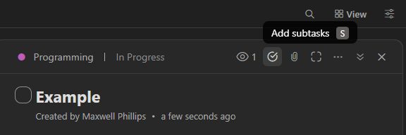
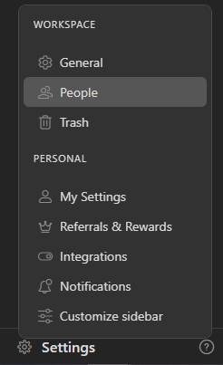
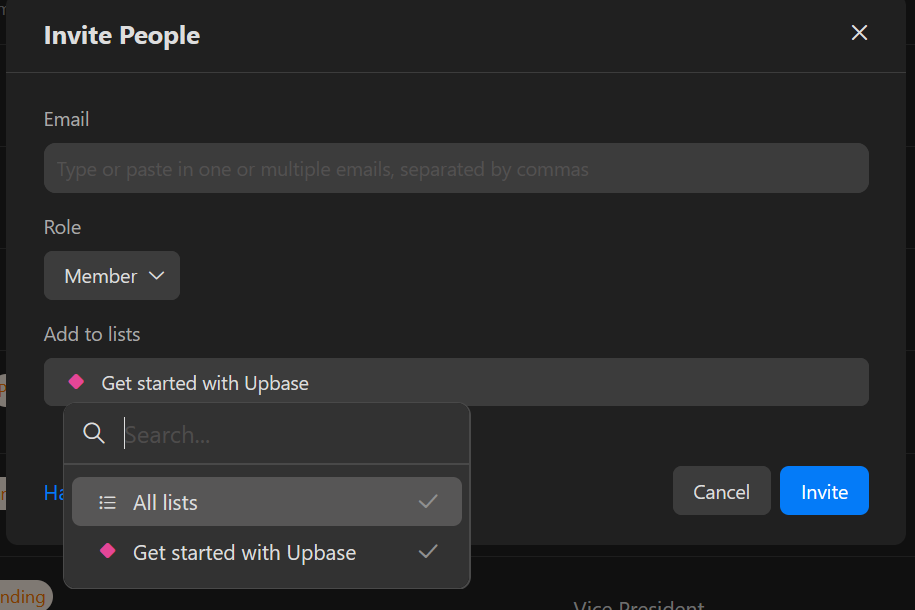
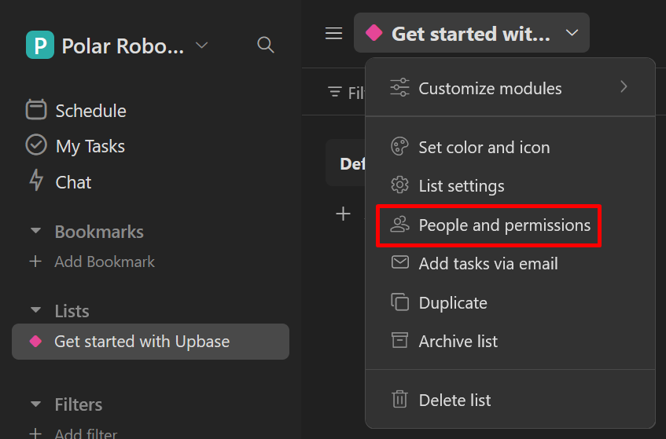

# Upbase
## Our Project Management Tool
### Overview
- [Upbase](https://upbase.io/) is a project management tool used to create, assign, monitor, and log tasks for each subteam.
	- All teams—not only team leads but also regular members—are expected to use Upbase to track their tasks.

```{admonition} Why Upbase?
:class: note

- We began using Upbase beginning in Fall 2024, replacing Trello and later ClickUp, due to the pricing model change and feature excess, respectively.
- Upbase is free for teams of unlimited size (unlike Trello, which is limited to 10) and has a clean user interface with a suitable but not overwhelming set of features.
```

```{seealso} 

- The official Upbase documentation can be found here: [https://help.upbase.io/category/4-gettings-started](https://help.upbase.io/category/4-gettings-started)
```

### Glossary and Structure
- Before discussing usage, it is important to understand what the different parts of Upbase's user interface are called and how it is structured.

```{seealso} 
- [https://help.upbase.io/article/8-workspaces-folders-and-lists-in-upbase](https://help.upbase.io/article/8-workspaces-folders-and-lists-in-upbase)
```

- Upon joining a team, you will be invited to the Polar Robotics *workspace*, which is "a top-level organizational unit" containing all relevant tasks for all teams.
- Each team (Design, Manufacturing, Build, Programming, and Drive) has their own **list**. The equivalent in Trello is a *board*. Lists are accessible via the navigation sidebar on the left. <br> {w=200px}
- There are two main modes for viewing a list: *list view* and *board view*. By default, when viewing a list, it may be in *list view*. 
- You may use either, but if you are used to Trello, you will likely prefer *board view*, and are used to referring to a *list* as a *board*.
	- List view looks like this: 
	- Board view looks like this: 
	- You can change between list and board view by clicking the `View` menu in the top right of the UI and selecting the appropriate button, as shown in the two images above. 
- Lists contain **sections**, which are visible in the pictures above – in this case, they are named `Future`, `Active`, and `Completed`.
	- In board view, *list sections* are the Upbase equivalent to Trello's *lists*.
	- In the same view menu as before, the default is to group by section. This is probably what you want, but you can explore different options at your discretion.
- List sections contain **tasks**, which are the core items used in Upbase. A *task* is a collection of information about a particular project or subproject, including assignees, due date, priority, tags, description, and links to relevant resources.
	- Tasks may also be colloquially referred to as *cards*.
	- Tasks may have *subtasks*, which have all the same properties as normal tasks, but they are not viewed as a normal "card" within the list of origin, except in certain special circumstances (explained in the [Subtasks](#subtasks) section below ).
- **Tags** are workspace-level entities that may be attached to individual tasks to denote grouping. 
	- Currently, we use tags for three purposes: 1. grouping tasks related to a specific robot or robot version, 2. grouping tasks related to a specific project, and 3. other miscellaneous administrative categories.
	- Usage details may be found in the [Tags](#tags) section below.

```{note}

- Within Polar Robotics, *lists* themselves may be referred to as "boards" and list sections may colloquially be referred to as simply "lists" or "task lists" – this is fine so long as everyone can understand what is meant.
	- For instance, "the Build board" refers to the Upbase list named "Build" assigned to the build team. Meanwhile, "the todo list" would refer to a list section named "Todo" in a specific list, say, `Programming` (which would be implied by context).
```

### Tasks
- **Tasks** are entities within a list section that contain information about a project or actual task, for instance, designing the new kicker, fixing a broken receiver net, or manufacturing a new baseplate for a lineman.
- Adding tasks to a list (section) is straightforward. There is a button labeled `Add task` at the bottom of each section. 
	- Upon clicking this button, you must input a name for the new task. Then, it will be added to the section.
	- Similarly, you can add sections with the `Add section` button.


  
- Once you have created a task, you can add several types of information to it. First, click on the task. 

{w=450px}

#### Main Features
- You should use all of the available built-in fields.
	- Most tasks will have a due date or deadline associated with them, likely determined by your team lead (or if you are the team lead, by you).
	- The `Assignee` field allows you to tie an Upbase user to a task. Use this to track who is working on what and follow up with them on their progress.
	- The `Priority` field has three (technically four) options: high, medium, and low (and technically none/unassigned). It is strongly recommended to use these to organize the urgency of tasks.<br> {w=200px}
		- For tasks of utmost urgency, we have also created a `Critical Priority` [tag](#tags) which should only be used in situations where a task is blocking many people or is absolutely necessary for competition or combine within a short timeframe.
	- The `Tags` field is used to add [Tags](#tags) to a task. 
		- If the task pertains to a particular project or robot, you must add that tag to the task. This is required to facilitate communication, especially across teams.
	- While Upbase supports custom fields, our free plan does not allow usage of this feature.
- You should also write a `Description` in the designated area.
	- The description supports a flavor of Markdown which can be utilized directly, but also has a rich text editor menu for formatting: <br> {w=200px}
- You may leave comments using the comment box at the bottom of the task pane, below the description.

```{note}

- Completed tasks are hidden by default. To enable them, click the `View` option in the top right corner, then switch on `Completed tasks`: <br> {w=150px}

```

#### Additional Features
- At the top right of the task pane, there are a few extra features that might be used occasionally: <br> {w=450px}
	- Similar to assignees, you can add watchers to a card using the eye icon (or by pressing `W`).
	- You can add [subtasks](#subtasks) using the icon of a checkmark within a circle (or by pressing `S`).
	- You can attach/upload files using the paperclip icon.
	- Within the dot menu, a few useful functions include the ability to:
		- mark a task as related to some other task, document, file, or link.
		- copy a link to the task.
		- duplicate/copy the task.
		- delete the task.

```{note}

- Deleting an item (list, task, etc.) will first send it to the Trash, accessible via the `Settings` menu in the lower left corner. Items in the Trash will be deleted permanently after 30 days.
```

- You can add a task to multiple lists by clicking on the list name in the top right corner of the task pane. For instance, you can add a task from the "Active" section of the Build list to any section of any other list, such as the "Open Projects" section of the Design list. <br> {w=450px} {w=200px}
	- Tasks can be moved from one list to another by using this method and then removing it from the original list.
	- Be warned – deleting a task from one list will remove it from all lists. However, it will still go to the Trash as normal.

```{seealso} 

- [https://help.upbase.io/article/41-related-items](https://help.upbase.io/article/41-related-items)
- [https://help.upbase.io/article/55-add-tasks-to-multiple-lists](https://help.upbase.io/article/55-add-tasks-to-multiple-lists)
```

### Tags
- **Tags** are entities shared between all lists in the workspace that allow grouping of and connection between individual tasks that have something in common (even between different lists).
- Currently, we use tags for:
	1. Grouping tasks related to a particular robot (such as the Quarterback V3)
	2. Grouping tasks related to a particular project (such as the PCB project)
	3. Other administrative or meta categories (such as "Needs Live Testing" or "Code Issue")
- You can create a tag by hovering over the Tags dropdown and clicking the plus icon. However, you should consult your team lead before creating any tags. <br> {w=200px}
- Tags can be grouped into folders or left at the top level. 
	- Currently we have two folders, one for robot-related tags and another for project-related tags (the first two use cases listed above). 
	- Other tags (the third use case) are left outside a folder. Tags outside a folder are placed at the top of the list above any folders.
	- Tags can be re-ordered or moved between/into folders by clicking, holding, and dragging.
- You can add a tag to an existing task by clicking in the `Tags` field within the task pane.
- The most important thing about tags is that they allow us to view all tasks with that tag as a list/board by clicking on the tag entry in the navigation sidebar.
	- You can filter or sort these in various ways, similar to using the `View` menu in a normal list.

```{seealso} 

- [https://help.upbase.io/article/30-task-tags](https://help.upbase.io/article/30-task-tags)
```


### Subtasks
- To add subtasks (i.e., checklist items) to a task, open the task and either 1. press `S`, or 2. press the checkmark button: <br> {w=450px}
- You can do essentially anything with subtasks that you can do with a normal tasks, except add subtasks. For example, you can add separate due dates, assignees, priorities, tags, and descriptions.
	- The primary difference is that subtasks typically appear in the list as part of a normal task.
		- If a subtask is given a tag that the parent task does not have, it can appear as if it were a normal task in that tag's list/board view.

### Administration
```{admonition} Critical Information
:class: danger

- **All lists are private by default** (unlike Trello).
	- That is, if you create a list, no one else can see it unless you grant them access to do so.
```

#### Adding Members to a Workspace
- In order to access any list, a team member must create an Upbase account and be added to the workspace by an admin.
- To invite/add users to the workspace, go to the workspace `Settings` menu in the bottom left corner of the UI, then click `People`. You will then be able to `Invite People` by email. <br> {w=200px}
- When inviting new members, be careful of two things: their role and their list permissions.
	- You can assign new members one of two roles: `Admin` or `Member`. 
		- `Admin` should only be given to officers and team leads, as an admin will have full access to any list they are added to. 
			- This cannot be changed without removing their `Admin` status. However, they can still be removed from lists. Even admins cannot see lists they are not invited to.
		- `Member` should be given to anyone else (most club members).
			- By default, `Member`s get `Full Access` to a list they are added to. 
				- Once added to a list, a member's permissions should be changed from `Full Access` to `Can View` (view-only) or `Can Comment` (recommended for those not on the team corresponding to the list).
				- As of 2024-09-04, these options have `(Soon)` written next to them, but are selectable after the member is added. However, they do not seem to be functional. I noticed no difference between this and `Full Access`.
- When inviting new members, you may also give them access to any or all existing lists: <br> {w=400px}
	- New members will recieve `Full Access` to any list they are added to upon being invited.

#### Adding Members to a List
- Once again, all lists are private by default. So, to add members to a list after they are added to the workspace, you must navigate to the `People and Permissions` page corresponding to the list: <br> {w=400px}
	- Then, click `Add members` in the top right corner, and you will be able to select any existing member of the workspace to add to the list.
		- You can add multiple members by clicking the dropdown menu and selecting someone multiple times.
		- Currently, only "Full Access" is supported, but "Can View" and "Can Comment" will allegedly be available soon.


