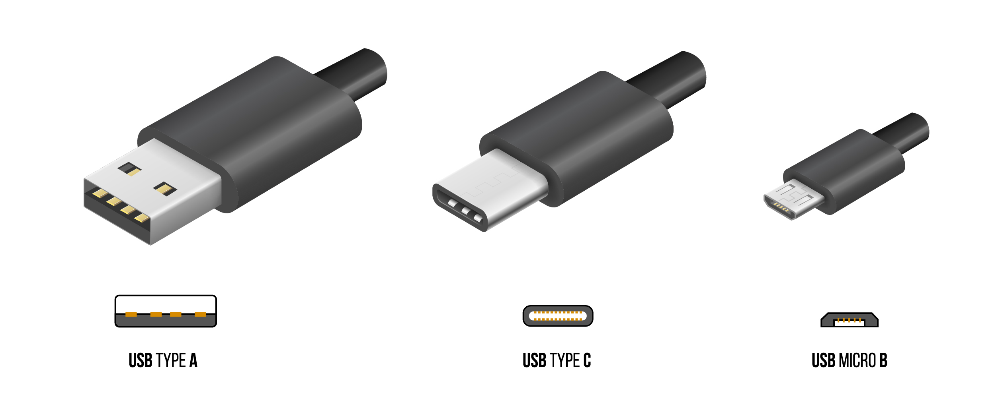
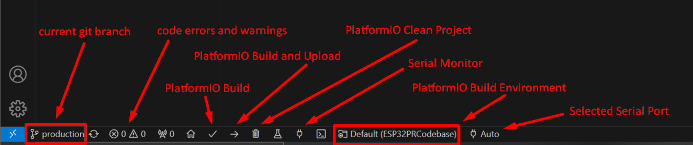
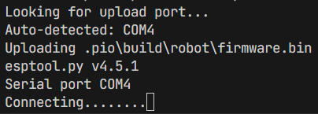
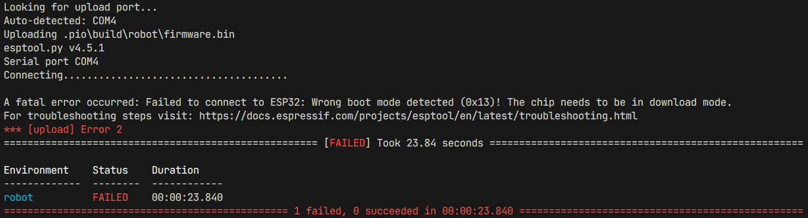

# Uploading Code to a Robot
## Overview
- In this tutorial, you will learn how to upload the code to a robot.
- Generally speaking, there are two steps.
	- First, the [robot parameters must be configured](#configuring-the-robot-parameters) so that the runtime code knows what type of robot it is.
		- Excepting rare circumstances or changes to the bot type data, this only needs to be done once per robot, and has likely already been done for you.
	- Second, the [ESP32 must be flashed with runtime code](#uploading-production-robot-code), typically the latest version of the `production` branch of ESP32PRCodebase.

### Prerequisites
- Completion of the [Development Environment Setup](./devenv) training, and by extension:
	- A computer with Git, GitHub Desktop, VSCode, and PlatformIO installed
	- A functional clone of the ESP32PRCodebase repo
- An ESP32 (does not have to be in a robot).
- A cable terminating in either USB-C or USB Micro-B (commonly referred to as "Micro USB"), depending on what port the ESP32 has.
	- The other end should be either USB-C or USB-A, depending on what ports your laptop has.
	- For reference: <br> {w=450px}

## Uploading Production Robot Code
```{danger}

- Ensure that the ESP32 is *not* connected to an ESP battery. **If you connect your computer to the ESP32 while the ESP is connected to its battery, you risk damaging your computer.**
- If you do accidentally do this, the best case is that nothing happens (possible if your computer is high-end and has good voltage regulation). The most likely case is that your computer will immediately shut down. The most probable worst case is that your USB port will break. We have had no computers outright die due to this (perhaps one port), but putting 7.7V into a 5V USB port is still not a good idea. 
```

For reference, here is the diagram of the taskbar again: 

1. Using the appropriate cable, connect your computer to the ESP32.
2. Ensure you are on the `production` branch.
	- Of course, for uploading code on any other branch, switch to the appropriate branch. However, this should only be for testing, and you should re-upload `production` code to the robot after you are done testing. 
		- If you are asked by someone outside the programming team to "upload code" to a robot, you should upload `production` code.
3. Select the `env:robot` environment.
4. Click the build-upload button (right arrow) in the PlatformIO taskbar.
5. If the build process completes successfully, you will soon see something like this: <br> 
 6. Depending on your computer, once these dots begin to appear, you may have to hold down the `BOOT` button on the ESP until they stop appearing, at which point you can release the button.
	 - This is required because the ESP must be in a specific boot mode in order to be *flashed* (have its code replaced in flash memory).
	 - Whether this is necessary or not differs between computer, with no reliable way of predicting which computers require it and which do not. It is, in almost all cases, always the same every time you upload with the same computer.
		 - If this is your first time uploading, you may want to "let it go" for a little while to see if it will automatically switch boot modes. If it does this, it will usually do this before around 15 dots. 
	 - If the loading bar reaches ~40 dots, the upload process will exit with the following error: <br> 
	 - The `BOOT` button is one of the two buttons directly adjacent to the USB-C or USB Micro-B port on the ESP32, the other being the `EN` button.
		 - The `EN` button, short for *enable*, is functionally a "reset" or "restart" button.
		 - This pinout diagram also shows the buttons, their positions, and their labels: <br> 

## Configuring the Robot Parameters
1. Follow Steps 1 and 2 of [Uploading Production Robot Code](#uploading-production-robot-code).
2. Instead of selecting the `env:robot` environment, select the `env:write_bot_info` environment.
3. Determine the "friendly name" of the robot you are uploading to. For example, `i++`, `:)`, or `9.8`.
4. In `/src/Utilities/WriteBotInfo.cpp`, in `void setup()`, *temporarily* change the value of `uint8_t index` from `0` to one of the following:
	1. A `#define` alias from `BotTypes.h` based on the robot's name, prefixed with `BOT_`. 
		- For example, `BOT_IPP` for `i++`, `BOT_SMILEY` for `:)`, or `BOT_9_8` for `9.8`. 
		- These identifiers consist only of capital letters, numbers, and underscores. Symbols are converted to as close of a representation as possible.
	2. The absolute index number corresponding to the robot, found in the `bot_config_t botConfigArray` in `/src/Utilities/BotTypes.h`. 
		- For example, `0` for `i++`, `5` for `:)`, or `8` for `9.8`.
5. Special case: if you need to change the parameters of a robot (name, position, motor type, or drive characterics), you have two options:
	1. Directly make a change to `bot_config_t botConfigArray` in `/src/Utilities/BotTypes.h`.
		- **If you do this, you must send a message in the programming channel in Discord to notify the team lead of this, *AND* reflect the changes in your commit message.**
	2. ***Temporarily*** change the custom bot configuration variables in `WriteBotInfo.cpp`, and enable `useCustomConfig`. Follow the instructions present in the code comments.
6. Proceed with Steps 4 through 6 of [Uploading Production Robot Code](#uploading-production-robot-code).
7. Revert any changes that you have made to `WriteBotInfo.cpp`.
8. Re-upload the production (or testing) code to the robot by following all steps in the [Uploading Production Robot Code](#uploading-production-robot-code) section.
	- If you do not do this, the robot will not function, in the practical sense. It will set the parameters each time the ESP32 boots, but it will not run any drive code, so it will not be useful in any way.